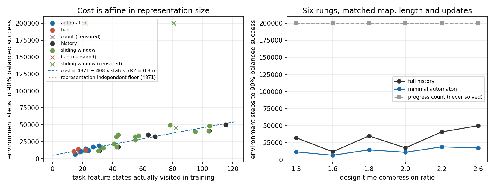

> **本报告第 4 节的"成本律"形式已被 [REPORT_STEP12.md](REPORT_STEP12.md) 更正。**
> 那个 4,417 的截距是把直线拟合到凹曲线上造成的，不是一项与表示无关的物理量。
> 正确的形式是幂律：达标步数约等于 26 × 最短路^1.2 × 状态数^0.8。状态数的指数 0.8 才是压缩的边界，减半只值 0.58 倍。
> 保留原文以便对照。

# Stage 8 第三步：压缩机会能不能换成学习收益

**结论：能，但只换到一部分。** 稀疏奖励下的样本成本是表示大小的**仿射函数**，不是正比函数。压缩只削减随状态数增长的那一项，剩下一个与表示无关的固定发现成本。合并回归给出

```
达到90%所需环境步数 = 4,417 + 399 × 训练中实际访问的任务特征状态数     R² = 0.92
```

那个 4,417 的截距，占最小自动机臂总成本的 16% 到 55%。纯正比模型的 R² 是 0.87，明显更差。

本轮共 1,152 组运行，6 个台阶 × 6 种表示 × 32 个种子，全部 tabular，没有学习到的合并，没有塑形，没有技能，没有噪声。

## 1. 为什么要换任务族

第二步的组合检查已经作废了原来的纯无序任务族：已完成事件的词袋在族内充分，而且恰好等于最小自动机，诚实压缩比在 n=3、4、5 上都是 1.00。固定一个敏感对也不行，"词袋加上那两个谁先"同样可以事先写下来。

新族每个实例随机抽一个敏感对，谁先完成决定后缀走哪一支，分支前插入长度 d 的共享桥段。桥段是必需的：没有它，做决定的那一刻宽度 n−1 的窗口就够用，因为唯一缺掉的无序标签能从计数反推；而分支专属标签一旦出现，宽度 1 的窗口也够用。

## 2. 地图必须换成走廊

开阔房间的可行走格按边长平方增长。为了强制出更多顺序而把边长加到 13，格子从 28 涨到 187，稀疏奖励下**所有臂在 20 万步内一次都没完成任务**，包括拿到真实最小状态的 oracle 臂。

改成走廊型地图后，25 到 31 个格子就能强制出 3 到 8 种唯一最优顺序，最短路径 25 到 27 步。这一步不是调参，是可行性前提。

每个台阶跑之前都验证：交叉点是割点，所有历史进入后缀前汇入同一格；每个起点恰有一个最优顺序且互不相同；两个分支都被覆盖；进度计数在某处必然产生歧义。

## 3. 六个台阶

地图规模、任务长度、每步更新数全部对齐。

| 台阶 | 设计期压缩比 | 唯一最优顺序数 | 最短路径 | 格子数 | 历史状态 | 最小状态 |
| --- | --- | --- | --- | --- | --- | --- |
| 1.3 | 1.30 | 3 | 25 | 28 | 28 | 20 |
| 1.6 | 1.60 | 4 | 25 | 28 | 24 | 15 |
| 1.8 | 1.80 | 5 | 26 | 31 | 40 | 20 |
| 2.0 | 2.00 | 5 | 25 | 31 | 39 | 19 |
| 2.2 | 2.21 | 6 | 25 | 28 | 64 | 29 |
| 2.6 | 2.59 | 8 | 27 | 31 | 76 | 27 |

## 4. 主结果

达到 90% 均衡成功率所需环境步数，32 个种子平均，未达标按 20 万封顶。

| 台阶 | 进度计数 | 完整历史 | 最小自动机 | 历史/自动机 | 95% 配对区间 |
| --- | --- | --- | --- | --- | --- |
| 1.3 | 未达标 0/32 | 32,531 | 11,875 | 2.74 | — |
| 1.6 | 未达标 0/32 | 11,406 | 6,688 | 1.71 | [1.62, 1.80] |
| 1.8 | 未达标 0/32 | 35,781 | 14,406 | 2.48 | [2.27, 2.40] |
| 2.0 | 未达标 0/32 | 17,812 | 10,969 | 1.62 | [1.55, 1.71] |
| 2.2 | 未达标 0/32 | 41,656 | 18,750 | 2.22 | [2.05, 2.40] |
| 2.6 | 未达标 0/32 | 50,281 | 17,062 | 2.95 | [2.77, 2.95] |

最小自动机臂在六个台阶上全部 32/32 达标，进度计数臂全部 0/32。区间为按种子配对的 bootstrap，未对多重比较校正。



## 5. 三条必须写下来的负面或意外结果

**设计期压缩比预测不了成本比。** 相关系数只有 0.21。用训练中实际访问的特征数算比值，相关系数是 0.81。原因是设计期比值只数最优轨迹上的前缀，而学习器在探索时会填进多得多的状态。**以后横轴一律用访问计数，设计期比值只作参考。**

| 台阶 | 设计期比值 | 实测特征比 | 实测成本比 |
| --- | --- | --- | --- |
| 1.3 | 1.30 | 2.81 | 2.74 |
| 1.6 | 1.60 | 2.03 | 1.71 |
| 1.8 | 1.80 | 2.90 | 2.48 |
| 2.0 | 2.00 | 2.30 | 1.62 |
| 2.2 | 2.21 | 3.34 | 2.22 |
| 2.6 | 2.59 | 4.26 | 2.95 |

**表示不充分不等于会失败。** 错误事件被忽略，所以别名状态下的 agent 可以依次试几个标签绕过去，多花步数但仍然成功。词袋臂在四个台阶上达标且是最快的，在另外两个台阶上停在 0.42 左右。窗口臂同样：宽度低于无别名宽度的窗口有时照样解决问题。所以别名检查只是出问题的必要条件，不是充分条件。哪个欠配的表示能侥幸成功，目前只能靠实测。

**一个更紧凑但不充分的表示可能比正确表示更快。** 词袋在台阶 1.3、1.8、2.0、2.2 上都比最小自动机快，因为它状态更少，而绕路的代价小于多学几十个状态的代价。这直接来自那条仿射规律。

## 6. 与 Stage 7 的关系

Stage 7 在稠密逐步奖励下测出成本几乎精确正比于状态数，截距只占 3.5%。本轮在稀疏终端奖励下截距占到 16% 到 55%。差别的来源是第一次成功的发现成本：稠密奖励几乎没有这一项，稀疏奖励下它与表示无关，压缩碰不到它。

## 7. 不能说什么

没有实现任何学习到的状态合并，本轮的自动机臂读的是预先算好的真实最小状态，是参考上界而非算法。没有做塑形、旧数据重解析、技能复用、反馈噪声。压缩比只铺到 2.6，且实测比值受限于几何强制装置能造出多少种唯一最优顺序，与第二步组合分析给出的族级潜力仍有 2 到 6 倍差距。所有结论限于本任务族与本地图族。

## 8. 验证

9 项测试通过，覆盖任务机语言正确性、最小化只合并未来等价状态、每个台阶的漏斗与计数歧义、起点唯一最优且两分支齐备、最优路径长度与独立最短路一致、各臂更新数完全相同、重跑逐位可复现、足够宽的窗口与完整历史行为完全一致、评价不创建特征。1,152 组运行的更新预算全部核对为每步 6 次。

- [执行计划](docs/PLAN.md) / [决策日志](docs/DECISIONS.md)
- [任务族组合检查](src/family_design.py) / [分母判定](src/baseline_denominators.py)
- [地图与任务](src/family_maps.py) / [走廊地图](src/spoke_maps.py) / [模拟器](src/compress.cpp)
- [原始数据](results/ladder32/raw.jsonl) / [成本律拟合](results/ladder32/cost_law.json) / [验证记录](results/validation_ladder.txt)
