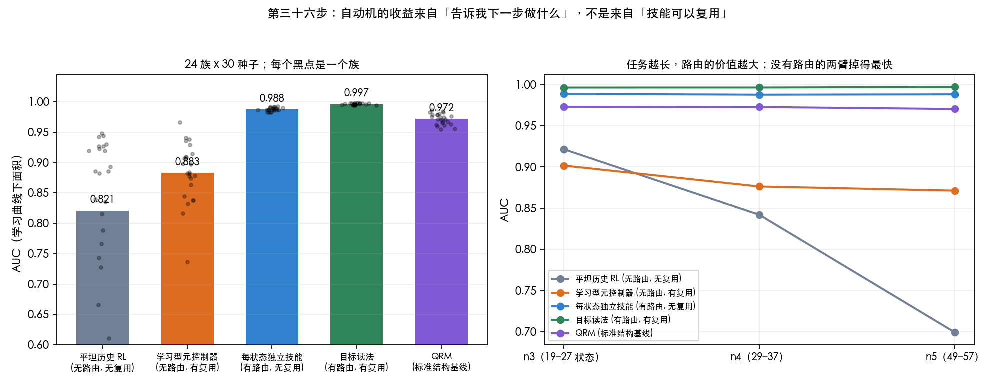

# 第三十六步：自动机的收益来自路由，不是来自技能复用

> **第三十八步修正（必读）**：本报告用 AUC 差值作效应量，而 Y11 在这批任务上几乎总在
> 天花板，于是 `Y11 − Y10` 只是在量 Y10 掉了多少（60 个单元上 corr = −0.998）。
> 改用样本复杂度（达到 90% 所需步数）重算同一批数据：**路由 6.39×，复用 5.34×，交互 0.30×**；
> 「路由之上再加复用只值 +0.008」在样本复杂度上是 **3.20× [2.94, 3.50]**。
> 路由仍略强于复用，但不是 4:1 的压倒关系。下文的 AUC 数字本身没错，作为**效应量**的解读作废。

归属那条线在第三十五步关掉了。这一步换问控制机制：同一份任务结构，既可以当成
价值表的索引，也可以当成「下一步该跑哪个已经学会的技能」的路由器。**收益究竟挂在哪个接口上，
其中又有多少其实只是「有可复用技能」本身？**

两个开关的 2×2，标准结构基线放在方格之外：

| | 无技能复用 | 有技能复用 |
|---|---|---|
| **无自动机路由** | Y00 平坦历史 RL | Y01 学习型元控制器 |
| **有自动机路由** | Y10 每状态独立技能 | Y11 目标读法 |

- **Y01** 用一个学到的价值从**全部**技能里挑目标，状态是物理格子加上平坦臂索引用的
  那同一个历史特征。它**不被告知任务状态，也不被给定正确的目标顺序**——后者会把整个
  分解伪装成 option schedule 偷偷塞回去。
- **Y10** 保留完全相同的目标读法，但每个 `(任务状态, 目标)` 学一份独立策略 \(\pi_{q,g}\)，
  阶段之间什么都不共享。
- **QRM** 不进方格：它是 \(Q(s,q,a)\) 这种标准用法，并排报告。

结构化方法都拿同一台**真实**任务机。非结构消融**刻意不**获得由任务机导出的目标信息——
那正是被消融的信道。其余全部共享：事件标签、环境动力学、奖励、训练预算。

---

## 结果（24 族 × 30 种子 × 5 臂，预算 200,000，每 250 步一个检查点）

| 臂 | AUC | 终局成功率 | first90 中位 | 达到 90% 的运行 |
|---|---|---|---|---|
| Y00 平坦历史 | 0.821 | 0.992 | 38,500 | 690/720 |
| Y01 学习型元控制器 | 0.883 | 0.942 | 4,000 | 710/720 |
| Y10 每状态独立技能 | 0.988 | 0.999 | 3,750 | 720/720 |
| **Y11 目标读法** | **0.997** | 1.000 | **1,000** | 720/720 |
| QRM | 0.972 | 1.000 | 7,000 | 720/720 |

配对自助（按**族**重抽，不按种子），AUC 差值与 95% 区间，`*` 表示区间不含 0：

| 对照 | 差值 | 区间 |
|---|---|---|
| 只加技能复用　Y01 − Y00 | +0.062 | [+0.008, +0.122] * |
| 只加自动机路由　Y10 − Y00 | **+0.167** | [+0.117, +0.223] * |
| 在技能之上再加路由　Y11 − Y01 | +0.113 | [+0.095, +0.134] * |
| 在路由之上再加复用　Y11 − Y10 | **+0.008** | [+0.008, +0.009] * |
| 两者都加　Y11 − Y00 | +0.176 | [+0.125, +0.232] * |
| 目标读法 vs QRM | +0.025 | [+0.021, +0.028] * |
| QRM vs 平坦 | +0.151 | [+0.103, +0.205] * |

主效应：**路由 +0.140，复用 +0.035，交互 −0.054**。

---

## 读法

**路由几乎拿走全部收益。** 单独加路由 +0.167，两者都加也只有 +0.176；
而在已经有路由的情况下再加复用，只值 +0.008。

**交互是负的（−0.054）：两个因子是替代品，不是互补品。** 路由已经把复用本来能给的东西
基本给完了——被告知下一步该做什么，比「同一个技能可以跨阶段共享经验」重要得多。

**任务越长，差距越大。** 按族规模分组：

| 组 | Y00 | Y01 | Y10 | Y11 | QRM | 路由主效应 | 复用主效应 |
|---|---|---|---|---|---|---|---|
| n3（19–27 状态） | 0.922 | 0.902 | 0.989 | 0.996 | 0.973 | +0.081 | −0.006 |
| n4（29–37） | 0.842 | 0.876 | 0.988 | 0.996 | 0.973 | +0.133 | +0.022 |
| n5（49–57） | 0.699 | 0.871 | 0.988 | 0.997 | 0.970 | **+0.207** | +0.090 |

有路由的三臂（含 QRM）几乎完全平坦；没有路由的两臂随规模下滑，平坦臂掉得最狠。
复用的主效应在最小的一组是**负的**，只有到 n5 才有意义——它是一个随规模才出现的二阶效应。

24 个族里，目标读法优于平坦的有 **24 个**，没有反向的族。

---

## 做过的稳健性检查

- **Y01 不是被超参数拖累的。** `option-cap` 从 8 扫到 256，AUC 在 0.873–0.887 之间，
  最好是 cap=16 的 0.887。取最好值，Y11 − Y01 仍有 ≈ 0.110。
- **平坦臂的退化不是特征表溢出。** 最大的族上它用了 274 个特征，上限 4096，`overflow_hits` 为 0。
  274 对比自动机的 56 个状态——这正是自动机提供的压缩，平坦臂必须为每条历史学一行。
- **默认路径逐位不变。** 加了 `--skill-key` 和 `--route` 之后，
  `history / automaton / merged / goal`（含 `--relabel`、`--goal-select learned`）
  的 `trace_hash` 与改动前的二进制完全一致。
- **Y01 的终局成功率 0.942 低于其余臂**（0.992–1.000），10/720 次运行没达到 90%。
  它学得快但稳得差，这一点在表里保留，不抹平。

---

## 局限

- 这是**我们自己的任务族**，不是公开 benchmark。下一步按计划去更长的公开组合任务。
- 所有结构臂拿的是**真实**任务机；把 ISA 学到的结构接进来是后面的事。
- 地图很小（28–40 格），所以「技能复用」能省的导航本来就不多。
  这可能系统性地低估了复用在大地图上的价值——n5 那一列的 +0.090 正是这个方向的信号。

---

## 文件

| 文件 | 作用 |
|---|---|
| `src/compress.cpp` | 新增 `--skill-key shared\|perstate`、`--route automaton\|meta`、`--option-cap` |
| `src/run_factorial.py` | 五臂实验与配对自助 |
| `src/plot_factorial.py` | 上面那张图 |
| `results/factorial.json` | 逐族逐种子原始结果 |
