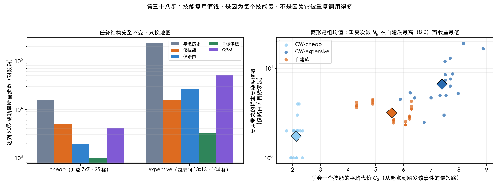

# 第三十八步：技能复用值钱，是因为每个技能贵，不是因为它被重复调用得多

顺带发现第三十六步的一个测量缺陷，并把那一步的结论改了。先说结论，再说改动。

---

## 1. 做了什么

`book / book-and-quill / cake` 三个公开任务结构展平后原样导入 `.task`（`src/export_craftworld.py`）。
每条边都是单个正字面量加若干否定，否定只在两个观测同时出现时定序；导出器一格最多放一个物体，
所以否定恒真，转换无损——这一点在代码里是断言而不是假设。

只换地图，别的一律不动：

| 条件 | 地图 | 自由格 |
|---|---|---|
| cheap | 开放 7×7 | 25 |
| expensive | 四房间 13×13，四道门 | 104 |

按预定**不加**岩浆（因此没有失败态）、不加朝向、每类仍只放 1 个物体。
3 个任务 × 2 条件 × 6 张地图 × 20 个种子 × 5 臂，预算 400,000。

---

## 2. 先修一个我自己的测量缺陷

第三十六步用 AUC 差值作效应量。**在这批数据上 Y11 几乎总在天花板（0.994–1.000）**，
于是 `Y11 − Y10` 实际上只是在量 Y10 掉了多少：60 个单元上

```
corr(Y10 的 AUC, Y11 − Y10) = -0.998
```

这不是一个效应量，是一个恒等式。改用**达到 90% 成功率所需步数**（无上界；Y10/Y11/QRM 三臂删失为 0，
但 Y00 在昂贵条件下删失 22%，涉及它的倍数需另行说明）：

| 任务 | 条件 | 仅路由 Y10 | 目标读法 Y11 | 复用的倍数 |
|---|---|---|---|---|
| book | cheap | 1,167 | 1,000 | 1.17× |
| book | expensive | 10,333 | 2,500 | **4.13×** |
| book-and-quill | cheap | 2,833 | 1,000 | 2.83× |
| book-and-quill | expensive | 45,667 | 3,500 | **13.05×** |
| cake | cheap | 1,833 | 1,000 | 1.83× |
| cake | expensive | 24,167 | 3,667 | **6.59×** |

---

## 3. 两个预注册检验

**检验 A：routing 跨到公开任务结构仍然成立。** 配对自助（按 36 张地图）：

| 对照 | AUC 差 | 区间 |
|---|---|---|
| Y11 − Y01（技能之上加路由） | +0.090 | [+0.075, +0.106] * |
| Y10 − Y00（只加路由） | +0.256 | [+0.160, +0.362] * |
| Y11 − QRM | +0.060 | [+0.040, +0.083] * |

**检验 B：导航变贵会放大复用。** 差的差，按 (任务, 地图) 配对：

- AUC 尺度：**+0.043 [+0.032, +0.055]**
- 样本复杂度尺度：**3.79× [3.10×, 4.59×]**

两条尺度都通过，区间都不含零点。

---

## 4. 机制：是 \(C_g\)，不是 \(N_g\)，也不是两者的乘积

你建议的横轴是 \(C_{\text{reuse}}=\sum_g (N_g-1)C_g\)。**在 CraftWorld 内部它很漂亮（r = +0.781），
但合并自建族之后就塌了。** 因为自建族的 \(C_{\text{reuse}}\) 是 214.6，**比 expensive 条件的 80.5 还高**，
复用收益却更低。

把乘积拆开，60 个单元合并，对 log(复用倍数) 的相关：

| 候选变量 | r |
|---|---|
| 平均 \(C_g\)（学会一个技能多贵） | **+0.756** |
| 平均 \(N_g\)（它被多少个任务状态要求） | +0.078 |
| \(C_{\text{reuse}}\) 乘积 | +0.252 |

三组的均值也只在 \(C_g\) 上单调：

| 组 | 平均 \(C_g\) | 平均 \(N_g\) | \(C_{\text{reuse}}\) | 复用倍数 |
|---|---|---|---|---|
| CW-cheap | 3.1 | 2.8 | 32.9 | 2.00× |
| **自建族** | **6.6** | **8.2** | **267.6** | **3.21×** |
| CW-expensive | 8.4 | 2.8 | 91.2 | 5.83× |

（\(C_g\) 原先少算一步——`event_cost` 把「一步就能触发」记为距离 0——已修正，
上表是修正后的值。排序与结论不变；合并相关为 \(C_g\) +0.756、\(N_g\) +0.078、\(C_{\text{reuse}}\) +0.214。）

按 \(C_g\) 排是 3.1 → 6.6 → 8.4，收益 2.00 → 3.21 → 5.83，单调；
按 \(N_g\)（2.8 → 8.2 → 2.8）和按 \(C_{\text{reuse}}\)（33 → 268 → 91）都不单调。

**所以：当前这个重复度指标无法解释跨组结果，导航难度值得继续关注。**
（原稿写成「重复次数本身几乎不贡献」，那超出了证据——\(N_g\) 从未被独立操纵，
cheap/expensive 同时改变了面积、拓扑与探索。）
第三十七步的审计（HRM 的重复度比我们低）与这一步的结果是一致的，不是矛盾。



---

## 5. 因此要改第三十六步

第三十六步说「路由 +0.140，复用 +0.035，交互 −0.054，两者是替代品」，并据此说
**收益几乎全在路由**。那是 AUC 口径下的说法，而 Y11 在那批任务上同样贴着天花板。
同一批数据改用样本复杂度重算：

| 对照 | 样本复杂度倍数 | 区间 |
|---|---|---|
| 只加技能复用　Y01 vs Y00 | 9.20× | [6.37, 12.92] * |
| 只加自动机路由　Y10 vs Y00 | 12.17× | [9.20, 16.30] * |
| 技能之上加路由　Y11 vs Y01 | 4.24× | [3.14, 6.06] * |
| **路由之上加复用　Y11 vs Y10** | **3.20×** | [2.94, 3.50] * |
| 两者都加　Y11 vs Y00 | 38.98× | [29.14, 52.18] * |
| 目标读法 vs QRM | 6.28× | [5.90, 6.67] * |

主效应：**路由 6.39×，复用 5.34×，交互 0.30×**（次可乘，仍是替代关系）。

**「复用之上再加路由只值 +0.008」这句话作废。** 它在样本复杂度上是 3.20×。
路由仍然略强于复用（6.39× vs 5.34×），但不是原来那种 4:1 的压倒关系，
两个因子量级相当。

---

## 6. 局限

- **组内相关和组间方向不一致。** \(C_g\) 在 CW-expensive 内部是 +0.646、在自建族内部是 **−0.569**。
  单调性只建立在**三个组均值**上，三个点不足以定形状，只够说「\(N_g\) 和乘积都不行，\(C_g\) 行」。
- 这轮**没有**岩浆、朝向、每类多物体。这是故意的（保因果干净），但也意味着还没检验
  不可逆性与复用的交互。
- 仍然是我们自己的模拟器和四向动作。按既定顺序，作者原生环境是外部效度检验，留到第三十九步。

---

## 7. 文件

| 文件 | 作用 |
|---|---|
| `src/export_craftworld.py` | 三个公开任务结构 × 两种导航条件 → 36 个 `.task` |
| `src/run_craftworld.py` | 五臂、两个预注册检验、样本复杂度口径 |
| `src/plot_craftworld.py` | 上面那张图 |
| `results/craftworld/` | 导出的任务与元数据（含每个事件的 \(C_g\)、\(N_g\)） |
| `results/craftworld_factorial.json` | 逐地图逐臂结果 |
