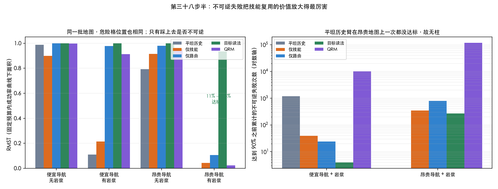
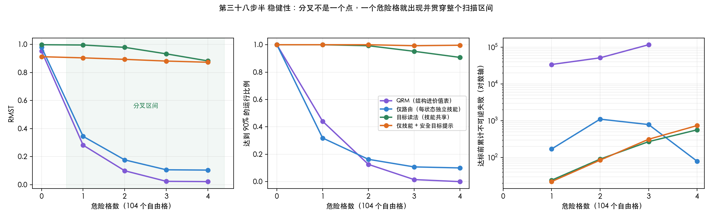

# 第三十八步半：不可逆失败把技能复用的价值放大得最厉害

第三十八步故意没加岩浆，所以整个项目起点的那个变量——不可逆失败——从来没和技能复用碰过面。
这一步把它补上，做成一个成对的 2×2，不新开一条线。

---

## 1. 设计

对每个任务、每张地图、每个地图种子，**同一张网格导出两次**：

- `safe`：危险格的标签存在但无害，自环、被忽略；
- `lava`：同样的标签、同样的格子，踩上去整幕失败。

所以字母表、物体位置、危险格位置、墙、每一条最短路都完全一致。
**危险格始终可以走进去，不是墙**，几何一点没动，变的只是走错一步的代价。
起点集合和时域只算一次（用 lava 变体算，因为 safe 变体否则会被允许穿过危险格抄近路），
两格共用。

危险格密度取自由格的 3%：便宜地图 1 个，昂贵地图 3 个。**这个剂量是调出来的**：
8% 时连最强的臂都在一百万步内达不到 90%，两个都删失的比值不是数字。

3 任务 × 2 导航 × 2 风险 × 6 地图 × 15 种子 × 5 臂，预算 1,000,000。

（早先草稿里把危险格个数写成 2 和 8，那是 8% 那次试跑的数字，已更正为 1 和 3。）

---

## 2. 口径：为什么头条不是比值

岩浆下删失是结构性的。密度只有 2% 时，仅路由臂在一百万步后仍未达标，
而目标读法 4,000 步就到了。按你定的规则，不把预算填进去凑比值，三样并排报：

| 导航 | 风险 | 臂 | 达标率 | 条件中位 T90 | 成功率 AUC | 达标前灾难 | 累计灾难 |
|---|---|---|---|---|---|---|---|
| cheap | safe | 平坦历史 | 100% | 18,000 | 0.987 | 0 | 0 |
| cheap | safe | 仅技能 | 100% | 6,000 | 0.898 | 0 | 0 |
| cheap | safe | 仅路由 | 100% | 2,000 | 1.000 | 0 | 0 |
| cheap | safe | **目标读法** | 100% | 2,000 | 1.000 | 0 | 0 |
| cheap | safe | QRM | 100% | 4,000 | 0.998 | 0 | 0 |
| cheap | lava | 平坦历史 | 12% | 6,000 | 0.110 | 1,180 | 273,126 |
| cheap | lava | 仅技能 | 23% | 2,000 | 0.213 | 39 | 254,680 |
| cheap | lava | 仅路由 | 99% | 2,000 | 0.977 | 24 | 422 |
| cheap | lava | **目标读法** | 100% | 2,000 | **1.000** | **4** | 461 |
| cheap | lava | QRM | 98% | 46,000 | 0.912 | 10,140 | 11,116 |
| expensive | safe | 平坦历史 | 100% | 248,000 | 0.793 | 0 | 0 |
| expensive | safe | 仅技能 | 100% | 14,000 | 0.914 | 0 | 0 |
| expensive | safe | 仅路由 | 100% | 20,000 | 0.980 | 0 | 0 |
| expensive | safe | **目标读法** | 100% | 4,000 | 0.998 | 0 | 0 |
| expensive | safe | QRM | 100% | 50,000 | 0.953 | 0 | 0 |
| expensive | lava | 平坦历史 | **0%** | — | 0.000 | — | 216,264 |
| expensive | lava | 仅技能 | 5% | 48,000 | 0.044 | 348 | 205,610 |
| expensive | lava | 仅路由 | **11%** | 36,000 | 0.106 | 785 | 57,520 |
| expensive | lava | **目标读法** | **95%** | 8,000 | **0.933** | 269 | 1,138 |
| expensive | lava | QRM | 1% | 772,000 | 0.024 | 116,619 | 215,602 |

---

## 3. 预注册问题一：岩浆放大复用——放大得极大

同一张地图、同样的危险格，只把「踩上去是否不可逆」打开：

| 导航 | 风险 | 仅路由 → 目标读法 |
|---|---|---|
| cheap | safe | RMST +0.000 |
| cheap | lava | +0.023 |
| expensive | safe | +0.018 |
| **expensive** | **lava** | **+0.827**（达标率 11% → 95%） |

（上表与本节其余的「RMST」实为**成功率曲线下面积 AUC**，越大越好；
真正的 RMST 是 \(E[\min(T,\tau)]\)，单位是步、越小越好。见第四十步。
换成真 RMST 与零步费协议后，昂贵条件的交互是 **+0.248 [+0.104, +0.412]**，
约为下面这个数的三分之一，但仍然显著。）

**差的差（按 36 对地图配对）= +0.416 [+0.270, +0.566]**，区间不含零。

这是本项目至今最大的一个效应。机制诊断也对得上：达到 90% 之前累计的不可逆失败，
便宜地图上目标读法 **4** 次而仅路由 **24** 次，昂贵地图上 **269** 对 **785**。
**学会一次安全执行某个目标，就能跨任务状态复用这份安全经验**——
仅路由臂要为每个 `(任务状态, 目标)` 各踩一遍坑。

---

## 4. 预注册问题二：修完两个缺陷后，**不成立**

这一节原来报的是「岩浆也放大路由」。修掉两个缺陷之后那个结论没有了，先说缺陷。

**缺陷甲（公平性）**：学习型元控制器可以把危险格本身选作目标，自动机路由的臂永远不会
（`allowed()` 只返回能推进且不致命的事件）。所以要给它一个 `--meta-safe` 对照，
直接告诉它哪些目标致命——这是 oracle 帮助，只作对照不作头条臂。

**缺陷乙（我写的 bug）**：`--meta-safe` 的第一版只在**训练时**排除致命目标，两处漏掉了。
一是冻结评估策略仍在全字母表上取 argmax，于是总去追那个从未被训练、值仍为 0 的岩浆技能；
二是更要命的，SMDP 的 bootstrap 项 `meta_best` 也在全字母表上取 max，
而被排除的目标值永远停在 0、真实选项都带负步费，**于是 bootstrap 恒等于 0，价值函数学不到任何东西**。
八个种子全是 0.00。修法是让三处共用同一个允许集合。

修好之后的对照（岩浆格，昂贵与便宜导航）：

| 导航 | 排除致命目标 | RMST | 达标率 | 累计灾难中位 |
|---|---|---|---|---|
| cheap | 否 | 0.213 | 23% | 254,680 |
| cheap | **是** | **0.875** | 100% | **428** |
| expensive | 否 | 0.044 | 5% | 205,610 |
| expensive | **是** | **0.882** | 99% | **1,002** |

于是路由效应变成：

| 对照 | 导航 | safe | lava | 差 |
|---|---|---|---|---|
| Y01 → Y11（有技能时加路由） | cheap | +0.102 | +0.125 | **+0.023** |
| Y01 → Y11（有技能时加路由） | expensive | +0.084 | +0.051 | **−0.033** |
| Y00 → Y10（无技能时加路由） | cheap | +0.013 | +0.867 | +0.853 |
| Y00 → Y10（无技能时加路由） | expensive | +0.187 | +0.106 | −0.081 |

**在「双方都有技能」这一行上，岩浆几乎不放大路由（+0.023 与 −0.033）。**
原先报出的 +0.502 / +0.688 来自上面那个 bug，作废。

`Y00 → Y10` 那一行仍然很大，但 Y00 根本没有技能库，所以那一格混了太多东西，
不宜当作路由效应的证据。

**顺带得到一个更有意思的事实**：在昂贵地图加岩浆时，
「有技能无路由」（0.882）远远打赢「有路由无技能」（0.106）。
**不可逆性放大的是复用，不是路由。**

---

## 5. 收回：QRM 的惨败是步费造成的，不是结构造成的

本节原来写的是「QRM 没有机制把怎样安全做 X 从一个任务状态搬到另一个」。**收回。**

第四十步跑完 6,480 次的协议网格：保留原终点奖励、只把步费从 −0.01 改成 0，
**QRM 在四个条件里全部快于 Y10**（昂贵+岩浆下 RMST 从 997k/达标 1% 变成 42k/100%）。
所以那个惨败是奖励协议的产物。

机制描述本身也错了：CRM 每一步就对多个任务状态做反事实更新，
它缺的是**共享的目标策略参数**，不是缺跨状态经验利用机制。

本节下面原有的 116,619 次灾难那个数字也要更正两处：它是 4 个达标运行的**中位数**而非平均数
（条件平均是 108,430.5），而且 785 与 269 分别来自 29 个和 257 个达标运行，
人群不同，不是公平对比。同固定百万步、全部运行的平均灾难数是 Y10 61,431、Y11 2,781。

---

## 6. 稳健性：危险格密度不是挑出来的

3% 是调出来的，这是第一个会被攻击的地方。所以冻结方法，只在昂贵导航上扫密度，
其余一律不动（同样的任务、地图种子、预算、种子数）。只跑最要紧的三臂加一个对照。

| 危险格 | QRM | 仅路由 Y10 | 目标读法 Y11 | 仅技能+安全提示 |
|---|---|---|---|---|
| 0 | 0.953 / 100% | 0.981 / 100% | 0.998 / 100% | 0.913 / 100% |
| 1 | 0.282 / 44% | 0.345 / 32% | **0.996 / 100%** | 0.905 / 100% |
| 2 | 0.099 / 13% | 0.177 / 16% | **0.980 / 99%** | 0.894 / 100% |
| 3 | 0.024 / 1% | 0.106 / 11% | **0.933 / 95%** | 0.882 / 99% |
| 4 | 0.022 / 0% | 0.104 / 10% | **0.883 / 91%** | 0.873 / 100% |

（格式为 RMST / 达标率。）Y11 相对 Y10 的 RMST 差：
0 个危险格 +0.018，然后 **+0.652、+0.803、+0.827、+0.779**。

**一个危险格就足以打开分叉，而且分叉贯穿整个扫描区间。** +0.827 确实是已扫五点里的最大值；
准确的说法是 2–4 个危险格与 3 个相差不到 0.05，1 个是 0.652。所以它是**过渡区间里的一个点**，
不是孤立的峰。

`QRM < Y10 < Y11` 在这张表的 AUC 口径下单调，**但它不是协议不变的**：
零步费下四个条件全部变成 `Y11 < QRM < Y10`。见第四十步。这条阶梯不能作为迁移前提。

---

## 7. 局限

- **危险格密度是调出来的**，但第 7 节扫过了：一个危险格就打开分叉，1–4 个之间差别不到 0.05。
- 岩浆只改代价、不改几何，这是刻意的；**没有**测「危险格挡住通路」那种几何型不可逆。
- 仍是自有模拟器、四向动作、真实任务机。
- 第三十八步那条关于 \(C_g\) 的话仍然按原样限定：只在三个组均值上单调，不升级成定律。

---

## 8. 文件

| 文件 | 作用 |
|---|---|
| `src/export_craftworld_lava.py` | 成对的 safe/lava 导出，危险格重采样保证任务仍可安全完成 |
| `src/run_craftworld_lava.py` | 2×2、两个预注册问题、删失感知的三口径报告 |
| `src/plot_lava.py` | 上面那张图 |
| `src/compress.cpp` | 新增 `--meta-safe`，以及 `fail_at_90` / `goal_deaths` / `goal_steps` 诊断 |
