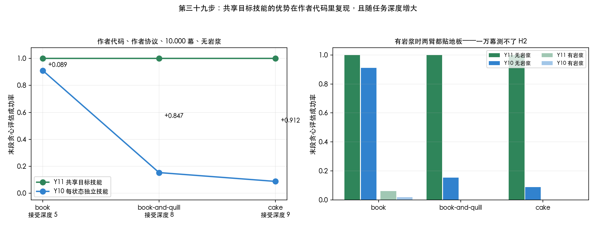

# 第三十九步：共享目标技能的优势在作者代码里复现，且随任务深度增大

在 `ertsiger/hrm-learning` 的原生实现里跑，环境是 `hrm-formalism-envs` 的 CraftWorld。
**H1 复现且强化；H2 在本轮预算下测不了，原因写在第 4 节。**

---

## 1. 设置

| 项 | 取值 |
|---|---|
| 代码 | 作者的 `ihsa-hrl`（= Y11）与新加的 `ihsa-hrl-perstate`（= Y10） |
| 协议 | **作者自己的**：`pseudoreward_after_step = 0.0`，无每步惩罚 |
| 任务 | `book`（展平深度 5）、`book-and-quill`（8）、`cake`（9） |
| 地图 | four_rooms 13×13，带岩浆，每类物体上限 2，幕长 1000 |
| 风险 | `lava`（踩上去终止）对 `safe`（同一张网格，拒绝态被中和） |
| 规模 | 3 任务 × 2 风险 × 2 臂 × 3 种子 × 10 个任务实例，每次 10,000 幕 |
| 结果口径 | 作者代码自带的贪心评估：每 100 幕用冻结策略在每个实例上跑一次 |

**风险对照是构造出来的，不是翻标志位。** 直接翻 `use_lava` 会挪动物体——危险格占掉一个位置、
挤走原有物体、并消耗随机数，后续布局整体错位（seed 0 上实测到 workbench 与 squid 都变了）。
所以两格用**同一张含岩浆的网格**，安全那格把层级里的拒绝态中和掉（`neutralize_deadends`）。
已验证：网格、起点、可观测集、可能观测集逐项相同；随机策略在 lava 格 92 幕全死于岩浆，
在 safe 格踩上去 226 次一次也不终止。

---

## 2. H1：复现，而且随深度增大

| 任务 | 深度 | Y11 | Y10 | 差（配对自助 95%） |
|---|---|---|---|---|
| book | 5 | **1.000** | 0.911 | +0.089 [+0.027, +0.172] |
| book-and-quill | 8 | **1.000** | 0.153 | **+0.847 [+0.743, +0.929]** |
| cake | 9 | **1.000** | 0.088 | **+0.912 [+0.841, +0.969]** |

（无岩浆条件，末段贪心成功率；配对单位是 (任务实例, 种子)，自助只重抽实例。）

**Y11 在三个任务上都是 1.000；Y10 随深度从 0.911 掉到 0.088。**
这是本地结论在作者代码里的复现，而且比本地更强——本地的复用效应要靠不可逆性才显著放大，
这里光是任务变深就足够了。

---

## 3. 本地与原生的对应

| | 本地模拟器 | 作者代码 |
|---|---|---|
| H1 方向 | Y11 快于 Y10，八格两协议全成立 | 三个任务全成立 |
| 随复杂度 | 路由效应随状态数增长 | **复用效应随接受深度增长** |
| 量级 | 样本复杂度 3.20× | 末段成功率 1.000 对 0.088 |

两边的复杂度轴不同（本地是状态数，这里是深度），所以不能把曲线接起来，只能说方向一致。

---

## 4. H2 没测出来，原因是地板不是证据

有岩浆时：`book` 上 Y11 0.061、Y10 0.020；`book-and-quill` 与 `cake` 上**两臂都是 0.000**。

所以「lava 的差 − safe 的差」算出来是 −0.847 和 −0.912，**这不是反向证据**，
是安全那格分开了而岩浆那格两臂都没离开地板。一万幕对带岩浆的深任务远远不够——
作者用的是 **200,000 幕**。

要测 H2 就得加幕数。本机实测：表格臂在无岩浆配置下约 0.20 秒/幕，
跑满作者的 20 万幕约 11 小时/次；**神经版（作者发表用的 `full_obs`）是 0.5 幕/秒，
20 万幕要 111 小时/次**，单机不可行。

---

## 5. 本轮的偏离，逐条声明

1. **表格而非 `full_obs`。** 作者发表用神经版；本机实测神经版慢 110 倍，20 万幕不可行。
   神经版 Y10 已实现并通过同样的等价性检查，只是没有预算跑网格。
2. **10,000 幕而非 200,000。** 无岩浆条件下 Y11 已经饱和（1.000），结论不受影响；
   有岩浆条件不够，见第 4 节。
3. **只跑作者协议。** 先跑的 `book` 上，`pseudoreward_after_step = −0.01` 的四个格子
   两臂**全是 0.000**，继续跑只会得到更多的零；协议敏感性已由本地 6,480 次的网格回答。
   那 12 次仍保留在归档里。
4. **QRM 缺席。** 作者没有表格版的 cross-product，CRM/DQRM 都是神经的。

---

## 6. 文件

| 文件 | 作用 |
|---|---|
| `src/run_native_grid.py` | 网格 runner，支持协议过滤与断点续跑，逐运行 JSONL 归档 |
| `src/analyze_native_grid.py` | 配对自助分析 |
| `src/plot_native.py` | 上面那张图 |
| `results/native_grid.jsonl` | 48 行原始结果，含完整配置、代码哈希与逐实例曲线 |
| `docs/environment/y10_perstate_arm.py` / `_dqn.py` | 两个 Y10 实现的副本 |
