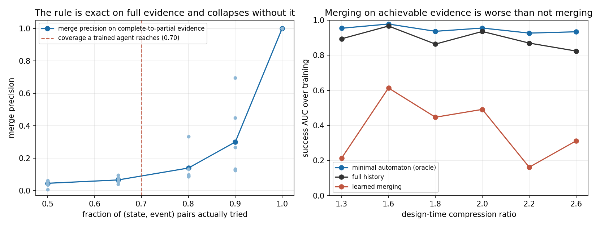

# Stage 8 第四步：学习到的状态合并

**结论是负面的，而且瓶颈定位很干净。** 合并规则本身正确：证据完整时它在六个台阶上全部精确恢复真实最小自动机，精度和召回都是 1.00，类数与真实类数完全相等。但它对缺失证据极度脆弱，而任务驱动的探索只能达到 66% 到 75% 的结构覆盖，且**加大探索率完全不能提高覆盖**。在可达到的覆盖下，合并精度是 0.07 到 0.31，第三步测出的压缩收益一点都拿不到。

跨六个台阶、32 个新种子的平均：

| 臂 | 达标步数 | AUC | 最终成功率 |
| --- | --- | --- | --- |
| 真实最小自动机（参考） | 13,365 | 0.947 | 1.00 |
| 完整历史 | 31,276 | 0.892 | 1.00 |
| 学习到的合并 | 32,042 | 0.373 | 0.28 |
| 进度计数 | 200,000 未达标 | 0.070 | 0.09 |

## 1. 算法

前缀树加证据驱动合并，不读任何任务机内部信息，有测试断言这一点。

每个节点记录两类证据：某事件在此推进了任务，或某事件在此出现但被忽略。两个节点冲突，当且仅当**同一个事件在一处推进、在另一处被忽略**。这是行为差异的正面证据。第一版只比较"观察到能推进的事件集合"是否相等，那个判据太松，早期几乎每个节点只观察到一两个推进事件，看起来都一样，精度只有 0.27。

合并是贪心加传播：尝试合并一对，沿共同事件把后继对一起并入，任一对出现冲突就整体拒绝。证据一变就从头重算，所以在薄证据上做出的合并会在反例出现时自动撤销，这被计为一次结构修订。修订只指原本合在一起的两个节点被拆开，不包括新增节点。

修订之后旧的类编号失效，值必须迁移。实现了三种策略：清零、按成员的旧类复制、清零后用原始缓冲区重放。原始缓冲区只存物理转移与事件序号，特征在重放时按当前结构现场重算。

## 2. 关键对照：规则对不对

把完全相同的判据放到完整证据上跑，即每个可达历史都试过每一个事件。

| 证据覆盖 | 精度 | 召回 | 类数与真实类数 |
| --- | --- | --- | --- |
| 100% | 1.00 | 1.00 | 六个台阶全部相等 |
| 90% | 0.13 到 0.69 | 0.22 到 0.83 | 已偏离 |
| 80% | 0.09 到 0.33 | — | 明显塌缩 |
| 65% | 0.04 到 0.10 | — | 塌缩 |

所以规则是对的，问题在证据。这条对照写成了测试。

## 3. 覆盖为什么上不去

要判定两个节点不同，需要同一个事件在一处推进、在另一处被忽略。但 agent 走向自己当前目标时没有任何理由回头去碰已经完成的标签。缺的是**否定证据**，而任务驱动的行为不产生它。

探索率扫描，台阶 1.8：

| epsilon | 结构覆盖 | 合并精度 | 最终成功率 |
| --- | --- | --- | --- |
| 0.02 | 0.64 | 0.42 | 1.00 |
| 0.10 | 0.65 | 0.28 | 0.80 |
| 0.30 | 0.64 | 0.29 | 0.00 |
| 0.60 | 0.65 | 0.25 | 0.20 |

**覆盖是平的，策略在变坏。** 随机动作在走廊地图里几乎不可能定向走到一个远处的标签，所以加噪声买不到结构证据。这与本项目 liveness 那一轮记录的覆盖尾巴是同一个机制：任务驱动的策略下覆盖会饱和，最后那一小撮状态动作对代价极高。

## 4. 一个必须写下来的指标陷阱

学习到的合并臂在六个台阶中的四个上，**首次达标步数与完整历史完全相同**，因为第一次合并触发之前它就是前缀树。只看这个指标会报"打平"。

同时它的最终成功率是 0.03 到 0.56，AUC 从完整历史的 0.82 到 0.97 掉到 0.16 到 0.61。也就是说它先达到门槛，随后被一次结构修订毁掉。**首次达标步数在存在结构修订时不是有效指标，必须配合 AUC 和最终成功率读。**

## 5. 开发集选出的是"最不合并"的配置

在 12 个开发种子上扫 theta 取 100、200、400，修订策略取清零、迁移、重放，共 648 组。按封顶达标步数选出 theta=400 加值迁移，35,792 步、70/72 达标。但它的合并精度只有 0.14、召回 0.12、类数 53 对真实 23。

**它跑得快是因为它几乎不合并。** 在可达到的覆盖下，合并本身是净负收益。

## 6. 这一步改变了什么

第三步已经证明压缩确实能换成样本效率，比值 1.60 到 2.95。第四步证明这份收益**不是这一类通用合并器在当前探索机制下能拿到的**，而且瓶颈不在合并规则，在结构证据的覆盖。

因此原计划里被推迟的"发现新边的内在奖励"从一条可选的轴变成了已经定位出来的瓶颈。它要解决的不是"探索得更多"，而是"为了区分状态而定向地去试特定的事件"，这与为了拿奖励而探索是两回事。

## 7. 不能说什么

没有证明一般自动机推断不可行，只证明了这一个证据驱动判据在这一族任务、这一族地图、这一套探索机制下拿不到收益。没有测试带噪反馈、置信度门槛、塑形、技能复用。三种修订策略之间的比较是在开发集上做的，没有单独做确认，不构成 H6 的结论。所有结论限于 tabular 与本任务族。

## 8. 验证

13 项测试通过，在第三步的 9 项之上新增 4 项：合并规则在完整证据上精确恢复真实最小划分；合并代码不读任务机内部信息，用源码扫描断言；证据门槛拉到极大时合并臂与完整历史逐位一致且零修订；三种修订策略产生不同行为但每步更新数完全相同。

- [第三步报告](REPORT_STEP3.md)
- [合并规则对照](src/merge_control.py) / [对照结果](results/merge_control.json)
- [模拟器](src/compress.cpp) / [确认数据](results/confirm2/raw.jsonl)
