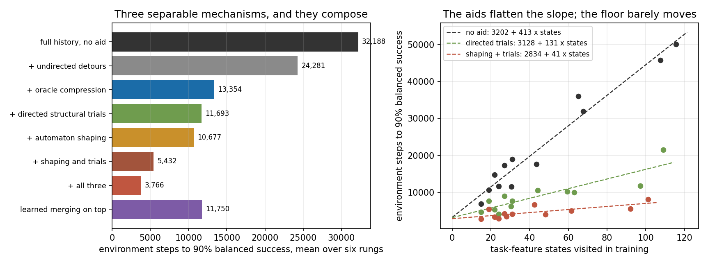

> **本报告的两条主要结论已被推翻，见 [REPORT_STEP5R.md](REPORT_STEP5R.md)。**
> 三个实现缺陷污染了这里的结果：合并的冲突检测只读并查集代表的证据、配额不约束传播出的子节点、塑形的 `deepest` 从未被赋值。
> 修复后 H4 的 No-Go 撤回，学习合并相对完整历史是 1.76 倍；H5 里"学习版差两倍"是尺度假象，统一尺度后两者相等。
> 下面第 2 节的"合并精度 1.00"也是错的，正式数据平均是 0.699。保留原文以便对照。

# Stage 8 第五步：修复合并的尝试，以及它意外找到的东西

**对 H4 的判决是 No-Go，但这一步找到了两个比压缩更大的机制。**

配额规则确实修好了合并的精度，从 0.14 提到 1.00。但修好之后合并几乎不再发生，召回只有 0.23 到 0.39。在完全相同的定向探索下，学习合并与完整历史的成本比是 **1.00，95% 区间 [0.99, 1.00]**，逐个台阶都打平，而 AUC 是 0.871 对 0.961，最终成功率 0.89 对 1.00。**学习到的合并贡献恰好为零，并且损害稳定性。**

同时，为了给合并买证据而做的定向结构探索，本身是一个大机制；随后加上的自动机塑形又是另一个。三者可以叠加。

跨六个台阶、32 个新种子、2,112 组运行：

| 臂 | 达标步数 | AUC | 最终成功率 |
| --- | --- | --- | --- |
| 完整历史，无任何辅助 | 32,188 | 0.891 | 1.00 |
| 加无目标的绕路 | 24,281 | 0.925 | 1.00 |
| 加真实最小自动机（压缩参考） | 13,354 | 0.948 | 1.00 |
| 加定向结构试探 | 11,693 | 0.961 | 1.00 |
| 加自动机塑形 | 10,677 | 0.959 | 1.00 |
| 加塑形与定向试探 | 5,432 | 0.982 | 1.00 |
| 压缩、塑形、试探三者全上 | 3,766 | 0.988 | 1.00 |
| 学习合并叠在定向试探上 | 11,750 | 0.871 | 0.89 |

配对比较，全部台阶全部种子合并：

| 比较 | 成本比 | 95% 区间 |
| --- | --- | --- |
| 定向结构试探的作用 | 2.75 | [2.62, 2.90] |
| 塑形的作用 | 3.01 | [2.87, 3.16] |
| 压缩的作用 | 2.41 | [2.33, 2.50] |
| 三者叠加后压缩还剩多少 | 1.44 | [1.38, 1.51] |
| 学习合并加了什么 | 1.00 | [0.99, 1.00] |

## 1. 配额规则做了什么

第四步的根问题是规则采用封闭世界假设：把"没有观察到差异"当成可以合并的许可。配额规则要求每个事件在两个节点上都**被试过**至少若干次，才允许它们合并，把"没有反驳"换成"看过之后仍然没有反驳"。

效果立竿见影，合并精度从 0.14 变成 1.00。代价是召回塌到 0.23 到 0.39，类数仍然远高于真实类数。**在可买到的证据量下，安全的合并等于几乎不合并。**

## 2. 定向探索，以及一个必须做的对照

定向探索用的是目标条件技能，不读地图。技能由每条真实转移重标记训练，所有臂都训练，只有探索臂被允许调用，因此更新预算完全相同。选目标的规则是"当前任务状态下试得最少的那个事件"。每一步绕路都计入同一个环境预算。

必须区分两件事：是绕路本身有用，还是选得准有用。

| 条件 | 达标步数 | 相对无辅助 |
| --- | --- | --- |
| 无辅助 | 32,188 | 1.00 |
| 随机选目标绕路 | 24,281 | 1.33 |
| 选试得最少的目标 | 11,693 | 2.75 |

**选得准值两倍。** 所以这不是"多走走就好"，而是"知道自己在当前任务状态下还没试过什么"这条信息本身有价值。这条信息来自对历史的记录，不需要任何合并，也不需要自动机。

## 3. 塑形，以及它的失败模式

势函数取当前任务状态到接受状态的估计剩余步数的负值。基础奖励始终不变，塑形只进内部训练奖励；缓冲区不存塑形后的奖励，势在重放时按当前结构现场重算。

学习版的势只用观察到的深度和至今见过的最深历史，第一次成功之前 frontier 会被当成终点，这是有意为之。特权版直接读真实距离，只作参考。

尺度在开发种子上按合并 AUC 选定，学习版 0.1、特权版 0.05。

**尺度取 0.4 时两种塑形都彻底崩溃**，达标数 0/72，最终成功率 0。这正是设计文档里预测的 frontier 停滞：塑形项压过任务奖励之后，停在已知结构末端成了一个稳定策略。这个失败模式是真的，尺度必须校准。

学习版 10,677 步对特权版 5,589 步。差的两倍就是**第一次解出任务之前不知道任务有多长**的代价，因为在此之前势函数的地平线只能用见过的最深历史估计。

## 4. 我上一轮的一个预测被数据推翻

我说过截距是与表示无关的发现成本，压缩碰不到它，而塑形是唯一瞄准它的手段。**数据不支持后半句。**

| 条件 | 截距 | 斜率 | R² |
| --- | --- | --- | --- |
| 无任何辅助 | 3,202 | 413 | 0.96 |
| 只加定向探索 | 3,128 | 131 | 0.77 |
| 加塑形与定向探索 | 2,834 | 41 | 0.55 |

**辅助手段压的是斜率，不是截距。** 每状态成本从 413 掉到 41，而地板几乎不动。所以截距不是"发现第一次成功的成本"，而是这个任务在这个预算下更基本的下限，三种机制都碰不到它。R² 随辅助增加而下降，说明"成本随状态数线性增长"这条规律是**无辅助学习器的性质**，不是普遍规律。

## 5. 现在能说什么

在这一族任务上，任务结构给强化学习的价值可以拆成三项可分离的机制，而且它们可以叠加，合起来把成本从 32,188 压到 3,766：

- **状态压缩**，2.41 倍，三者叠加后还剩 1.44 倍
- **定向结构试探**，2.75 倍，只需要知道当前任务状态下哪些事件还没试过
- **结构导出的塑形**，3.01 倍，把稀疏终端奖励变成中间信号

其中只有第一项需要最小自动机，而它恰恰是学不到的那一项。后两项只需要**已发现的边和已记录的历史**，都落在"正面证据就够"的那一侧。

只用可学到的东西，最好的组合是完整历史加塑形加定向试探，5,432 步，已经接近特权塑形的 5,589 步，并且比真实最小自动机单独使用的 13,354 步快 2.5 倍。

## 5b. 更正：第 2 节那 2.75 倍的归因是错的

落实 L\* 式查询选择时做的对照推翻了原来的说法。把定向绕路逐层拆开，beta=0.15，32 个配对种子：

| 这一层加了什么 | 倍数 | 95% 区间 |
| --- | --- | --- |
| 绕路这件事本身，随机选目标 | 1.28 | [1.23, 1.34] |
| 改成朝没拿过的标签走，**零结构** | 1.63 | [1.55, 1.71] |
| 改成按任务状态记账选最少试过的，需要历史 | 1.28 | [1.22, 1.33] |
| 换成 L\* 式的分离实验 | 1.00 | [1.00, 1.00] |
| 合计 | 2.66 | [2.54, 2.78] |

绝对步数：不绕路 31,250、随机绕路 24,411、朝没拿过的标签 14,979、按任务状态记账 11,745、L\* 式 11,755。

三条更正：

**第一，真正需要结构的部分只有 1.28 倍，不是 2.75 倍。** 最大的一层是"朝这一局还没拿过的标签走"，那是一个不需要任何任务结构的朴素启发式，值 1.63 倍。

**第二，L\* 式的分离实验一点没加。** 倍数 1.00，区间退化成 [1.00, 1.00]。在这一族任务上，能分开两个假设类的实验和试得最少的事件几乎总是同一个。

**第三，"定向结构试探"这个名字本身取错了，它没有在买结构证据。** 结构覆盖在所有目标选择规则、所有绕路预算下都平在 0.80 左右：beta 取 0.01 只绕路 7 千步，覆盖 0.81；beta 取 0.15 绕路 7 万 5 千步，覆盖 0.78。而覆盖最高的那一条恰恰是学得最差的随机选目标。所以绕路买到的是**稀疏奖励下更好的任务探索**，不是结构证据。

这不改变第 5 节里"三条机制叠加把成本从 32,188 压到 3,766"这个事实，但改变了对中间那一条的解释：它是一个目标导向的探索策略，其中只有一小部分依赖任务状态记账。

## 6. 不能说什么

没有证明一般自动机推断不可行，只证明了这一个证据驱动判据在配额约束下贡献为零。塑形与探索的超参数在开发种子上选定，确认集只跑了选定值。没有反馈噪声、没有置信度机制、没有技能复用的独立评估、没有旧数据重解析的对照。三种修订策略只在开发集比较过，不构成 H6 结论。全部限于 tabular 与本任务族本地图族。

## 7. 验证

18 项测试通过，在前 13 项之上新增 5 项：塑形尺度为零时与不塑形逐位一致；结构绕路计入同一预算且更新数不变；beta 为零时行为完全不变；配额拉到不可达时合并器退化为前缀树且与完整历史逐位一致；接受状态的势为零。

- [第三步报告](REPORT_STEP3.md) / [第四步报告](REPORT_STEP4.md)
- [模拟器](src/compress.cpp) / [运行器](src/run_explore.py)
- [确认数据](results/full/raw.jsonl) / [覆盖预算估算](src/coverage_budget.py)
