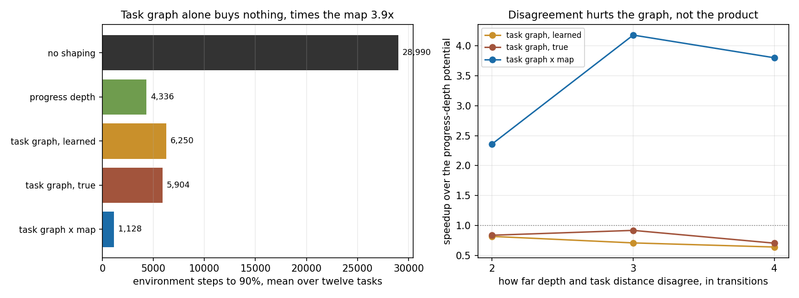

# Stage 8 第六步：把"进度深度"和"任务图"分开，结果指向第三样东西

按 9.10 复评的建议执行。结论有三条，最后一条不在原计划里。

**一、任务图距离相对进度深度势没有优势。** 十二个任务、32 个新种子、各自最优尺度下，任务图距离相对深度势是 0.73，按任务成块的区间 [0.48, 1.16] 包含 1，即未能分辨且方向为负。学习到的图距离与真实图距离无法区分，所以这不是推断质量的问题。按复评预先写下的读判顺序，这属于"任务没有显现额外结构价值，暂不归咎于推断器"。

**二、过程中发现并控制了一个尺度混杂。** 折扣下的势函数塑形对势的量程不是不变的：不改变任何东西的一步，其塑形项是 (γ−1)Φ，等于按"离终点多远"发放的每步补贴。量程更大的势因此在同一个名义尺度下发放更强的信号。按名义尺度对比会偏向量程大的一方；按起点值归一化则把结论翻转过来。最终采用各自在开发集上选出的最优尺度，十二个任务上三种势都选到 0.07，混杂消除。

**三、真正有用的不是任务图距离，是乘积距离。** 把任务状态与地图位置的乘积上的最短剩余环境步数作为势，相对深度势是 **3.85 倍 [2.79, 5.21]**，相对任务图距离是 **5.24 倍 [3.47, 7.46]**，十二个任务逐个成立。首次成功从 5,209 步降到 269 步。

## 1. 任务设计

复评要求构造"同一物理交叉点、同一进度计数下，历史决定不同后缀且剩余接受距离不同"的任务。做法是让两条分支的尾巴长度不等。

于是在共享桥段末端，两条分支站在同一格、进度计数相同，但欠下的任务转移数不同。十二个任务的分歧量是 2 到 4 次转移，每个任务都用精确乘积状态验过；同时保留了原有的验证，即位置加进度计数不能替代历史。

物理路径长度与任务长度分开报告：物理最短 11 到 34 步，任务长度 6 到 13 次事件。两者不成比例，这一点在第三条结论里变成了关键。

尾巴不等长之后，原来那个单一 `solved_length` 的假设不再是"任务长度"，它只是首次成功那条分支的长度。深度势因此在另一条分支上系统性地估错，这是它作为基线的已知局限，不是缺陷。

## 2. 四种势

| 名称 | 势的定义 | 需要什么 |
| --- | --- | --- |
| 无 | 恒零 | |
| 深度势 | 首次成功长度或已见最深深度，减当前深度 | 只要进度反馈 |
| 任务图距离，学习 | 在已发现的前缀图上，到已发现接受节点的最短转移数 | 已发现的边 |
| 任务图距离，真实 | 在真实任务机上到接受状态的最短转移数 | 特权 |
| 乘积距离 | 在任务机与地图的乘积上，到接受的最短环境步数 | 特权，且需要当前位置 |

学习图距离在找不到通往已知接受节点的路径时回退到深度势，与基线保持一致，所以两臂只在学习器确实知道些什么的地方才不同。

## 3. 主结果

12 个任务 × 32 个新种子，每臂 384 条运行，全部达标。

| 塑形 | 尺度 | 达标步数 | 首次成功 | 首次成功后 | AUC | 最终成功率 |
| --- | --- | --- | --- | --- | --- | --- |
| 无 | 0.05 | 28,990 | 5,209 | 23,780 | 0.905 | 1.000 |
| 深度势 | 0.07 | 4,336 | 1,100 | 3,236 | 0.990 | 1.000 |
| 任务图距离，学习 | 0.07 | 6,250 | 1,100 | 5,150 | 0.985 | 1.000 |
| 任务图距离，真实 | 0.07 | 5,904 | 1,255 | 4,649 | 0.986 | 1.000 |
| 乘积距离 | 0.02 | 1,128 | 269 | 858 | 1.000 | 1.000 |

按任务成块的配对 bootstrap，12 个块，10,000 次重采样：

| 比较 | 比值 | 95% 区间 |
| --- | --- | --- |
| 深度势相对不塑形 | 6.69 | [4.15, 10.42] |
| 任务图距离相对深度势 | 0.73 | [0.48, 1.16] |
| 乘积距离相对深度势 | 3.85 | [2.79, 5.21] |
| 乘积距离相对任务图距离 | 5.24 | [3.47, 7.46] |

乘积势在十二个任务上逐个优于深度势，比值从 1.66 到 5.53。

## 4. 为什么任务图距离没用

排除了一个解释，留下一个关联。

**不是策略被带偏。** 收敛后的策略在最短路的 1.03 到 1.06 倍之间，图距离那两臂反而略更接近最优。劣势全部出现在首次成功之后的巩固阶段。

**劣势随深度与距离的分歧单调上升。** 分歧为 2、3、4 的任务上，学习图相对深度势的成本比分别是 1.19、1.42、1.52，对分歧的斜率 0.150，相关 0.64。这是关联，十二个点，不足以升级成因果。

**最可能的解释由第三条结论给出。** 任务图距离衡量的是还欠多少次任务转移，而 agent 付的是环境步数。这些任务里物理路径长度 11 到 34、任务长度 6 到 13，两者不成比例，所以任务图距离是"还要走多久"的一个很差的代理。乘积距离量的正是环境步数，它把差距一次补齐。

## 5. 与项目主线的关系

这条结果与本项目更早的记录一致：结构的价值在于它是一个**可以与地图相乘**的对象，而不在于它本身的图。这一轮第一次给了这个说法一个塑形上的数字：单用任务图的势相对一个朴素进度启发式是 0.73，把同一个任务图与地图相乘之后是 3.85。

## 6. 不能说什么

乘积势是特权参照，它读真实任务机和真实地图距离，用来标出上限，不是一个方法。可学习的版本应当从成功轨迹上反向计数得到 (任务状态, 位置) 到成功的步数估计，这是下一步。

任务图距离那条比较在 12 个任务块上区间包含 1，属于未分辨而非已证否；要判定需要更多冻结任务。所有结论限于这一族任务与这一族走廊地图，无噪声，表格式学习。

## 7. 验证与记录

25 项测试全部通过。任务文件追加乘积距离表之后做了回归检查，既有臂的轨迹哈希与追加前完全一致。每批确认记录了源码与二进制 SHA256、每个任务文件的 SHA256、全部开关与尺度、种子区间与预算，`strict_children` 显式写入命令行而非依赖默认值。

- [任务构造与验证](src/depth_vs_graph.py) / [任务与清单](results/depth_vs_graph/)
- [确认数据](results/depth_vs_graph/final_product.jsonl) / [运行清单](results/depth_vs_graph/manifest_product.json)

