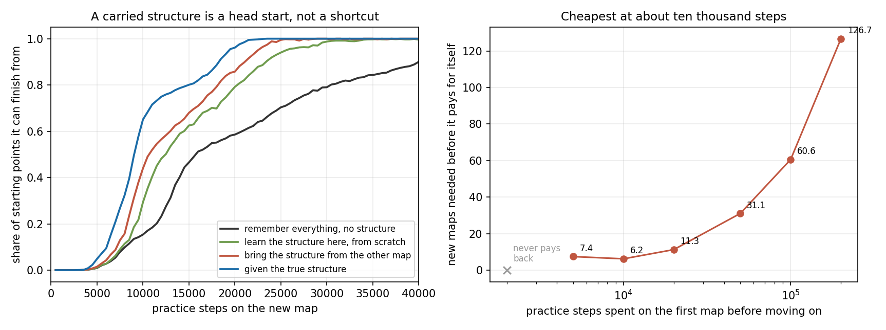

> **本报告的迁移收益结论已被 [REPORT_STEP9.md](REPORT_STEP9.md) 收回一半。**
> 把地图对从 6 组加到 25 组之后，"搬过来相对从零学"变成 1.08 [0.95, 1.24]，区间包含 1。
> 点估计几乎没变，变的是区间：块自助法的块是地图对而不是种子，六个块量不出地图间方差。
> 因此第 5 节的摊销与回本结论一并收回。采购价一万步这个数仍然成立，它量的是结构何时饱和。
> 保留原文以便对照。

# Stage 8 第八步：学到的任务自动机能不能搬到另一张地图上

这一步回到最初的设想去检验它隐含的那个承诺：**画出来的自动机，以后还能用。**

到此为止的每一个实验都是在一张地图上学一个自动机，用完就扔。那是最苛刻的测法，因为结构必须在同一次训练里把自己的发现成本赚回来。这一步把同一个隐藏任务放到两张不同的地图上。

**结论：自动机确实能搬，代价约一万步，摊到大约六张新地图之后回本。**

## 1. 什么东西能搬，什么不能

学习器记的那棵树只记一件事：**在哪一段历史之后，哪个事件推进了任务**。这句话里没有任何一个格子。所以它整体可搬。

不能搬的是所有按格子索引的东西：任务 Q 表、技能表、学到的地图图、乘积距离。这些在地图 B 上全部从零开始。

实现上，源地图训练完把这棵树导出成一张纯文本表，目标地图载入时**用本次运行自己的编码重新计算每个节点的键**，而不是信任文件里的编号。

## 2. 六对地图

每对两张地图承载完全相同的任务机，也就是相同的无序目标数、相同的敏感对、相同的桥段和两条尾巴，只是走廊布局与标签位置不同。每张地图都单独通过原有的全部验证：出口是割点、进度计数在某处必然产生歧义、每个起点恰有一个最优顺序、两条分支都被覆盖。

物理最短路在 12 到 31 步之间，可走格 28 到 31 个。

## 3. 在新地图上的表现

六对地图 × 32 个种子，共 768 组运行。

| 臂 | 达标步数 | 首次成功 | AUC | 合并精度 | 召回 |
| --- | --- | --- | --- | --- | --- |
| 完整历史，不学结构 | 27,688 | 6,705 | 0.901 | | |
| 在新地图从零学结构 | 18,245 | 5,923 | 0.931 | 0.99 | 0.46 |
| 把旧地图的结构搬过来 | 16,417 | 5,230 | 0.939 | 0.98 | 0.33 |
| 直接给真实自动机 | 12,823 | 5,070 | 0.951 | | |

按地图对成块的配对 bootstrap，6 个块：

| 比较 | 比值 | 95% 区间 |
| --- | --- | --- |
| 在新地图从零学结构，相对完整历史 | 1.52 | [1.28, 1.75] |
| 把结构搬过来，相对从零学 | 1.11 | [1.05, 1.17] |
| 搬来的结构距离真实自动机 | 1.28 | [1.12, 1.55] |
| 真实自动机相对完整历史 | 2.16 | [1.72, 2.79] |

**搬过来只值 1.11 倍，因为在这个设定里结构本来就便宜**，当场学也很快。这与前面几轮反复出现的那条一致：反馈完全准确时，发现结构的成本很低。

## 4. 领先出现在中段，然后被追平

看学习曲线更清楚。训练到某一步时能从多少比例的起点完成任务：

| 训练步数 | 从零学结构 | 搬过来 | 差 |
| --- | --- | --- | --- |
| 5k | 0.011 | 0.015 | +0.003 |
| 10k | 0.293 | 0.440 | **+0.146** |
| 20k | 0.792 | 0.858 | +0.066 |
| 50k | 0.999 | 1.000 | +0.001 |

**搬来的结构是一个领先，不是一条捷径。** 在一万步处领先最大，相对提升五成，到五万步完全被追平。

## 5. 这份资产要多少钱，摊几张地图回本

关键问题是源地图上要练多久。把源预算从 2 千扫到 20 万：

| 源地图预算 | 学到的结构节点 | 其中接受节点 | 目标地图达标 | 相对从零省下 | 回本需要几张地图 |
| --- | --- | --- | --- | --- | --- |
| 2,000 | 22 | 0.3 | 18,698 | −453 | 不回本 |
| 5,000 | 31 | 1.1 | 17,573 | 672 | 7.4 |
| 10,000 | 41 | 2.4 | 16,635 | 1,610 | **6.2** |
| 20,000 | 52 | 4.5 | 16,469 | 1,776 | 11.3 |
| 50,000 | 56 | 5.4 | 16,635 | 1,610 | 31.1 |
| 200,000 | 57 | 5.5 | 16,667 | 1,578 | 126.7 |

三条读法：

**结构在一万到两万步之间就饱和了。** 节点数停在 57，接受节点停在 5.5，目标地图的收益停在省下一千六到一千八百步。**在源地图上继续练，对迁移一点增益都没有。**

**只练两千步的结构比没有还糟**，目标地图反而多花 453 步。半成品的结构会误导。

**最划算的采购点是一万步，摊到大约六张新地图之后回本。** 如果对照的不是"在每张新地图上重新学结构"而是"根本不学结构"，那么省下的是 27,688 减 16,417，一万步的采购在**第一张新地图上就回本了**。

## 6. 这一步回答了最初设想里的哪一句

最初的设想是：探索、建自动机、下次先做完已知部分再探索未知、最终画出完整自动机、靠它快速完成任务。前四句在前几个阶段都已经实现并量化。第五句隐含着"这张图以后还能用"，而在此之前从来没测过。

现在有了数字：**能用，值 1.11 倍，采购价一万步，六张地图回本；如果替代方案是完全不用结构，第一张就回本。**

## 7. 不能说什么

六对地图，块自助法只有六个块，区间偏宽。两张地图都出自同一个走廊生成器，只是布局不同；跨到别的地图族没有测过。任务机在两张地图上完全相同，事件词表也相同，所以这测的是"换地图"，不是"换任务"。全部无噪声、表格式。

回本张数依赖于目标地图上的对照选谁：对"每张地图重新学结构"是六张，对"不学结构"是一张。两个都在上面报了。

## 8. 验证与记录

结构导出改成纯文本表，因为手写的 JSON 解析器出过两次错，一次锚点找到了同名的顶层字段导致越界，一次数字解析没跳过方括号。载入时重算节点键而不信任文件编号。载入节点的真实类别由路线重放任务机得到，否则全部记成 0 号类，诊断出来的精度召回是假的，这个错也犯过并修掉。

每批记录源码与二进制 SHA256、全部开关、种子区间与预算。

- [地图对构造](src/transfer_maps.py) / [结构导出](src/structure.py) / [运行](src/run_transfer.py)
- [新地图表现](results/transfer_run/raw.jsonl) / [学习曲线](results/transfer/curves.jsonl) / [摊销扫描](results/transfer/amortise.jsonl)
