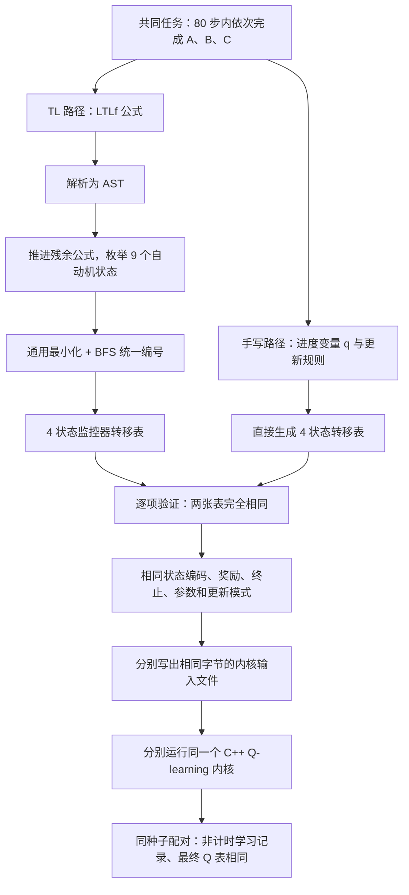

# TL 与手写任务表示：已有实验、等价发生的位置及结论边界

汇报整理日期：2026-09-07。依据本地保存的实验结果、当前源码和本轮复核。本文不报告新训练实验。

## 1. 可以向老师先讲的结论

我们最初希望判断：同一个 RL 任务使用 TL 描述，是否会带来手写实现无法获得的求解优势。为此，逐步把“表达语言”“交给学习器的任务结构”“学习器如何利用结构”分开比较。

**目前的核心结果是：在已经验证的有限时域任务中，TL 编译得到的任务监控器经过最小化后，与独立手写监控器得到相同的状态和转移表。两者再接入相同的奖励、状态编码和学习算法，配对运行得到相同的学习记录和最终 Q 表。反事实更新改善学习的效果也可以完整地由手写监控器实现。**

这排除了本实验条件下“仅仅因为任务来源是 TL，就会额外改善 RL”的解释。它没有证明所有 TL 方法和所有手写实现都一样，也没有证明任务结构对 RL 没用。相反，结果显示：**结构如何进入学习更新，比它原来用什么语言写更直接地影响本实验中的学习表现。**

同样需要坦诚说明：完成监控器和 RL 接口的对齐之后，学习结果一致本来就有理论预期。因此，这轮工作的价值主要是核实等价发生在哪一层、校准比较方法、分离性能收益的来源；目前不足以作为一个新算法或新的复杂度定理。

## 2. 这里的 TL 和“手写”分别指什么

本文主实验中的 TL 特指 **有限轨迹上的线性时序逻辑 LTLf**，采用布尔满足语义。它不是泛指所有 STL、无限轨迹 LTL、鲁棒度奖励或所有自动机方法。

- **TL 路径**：作者写公式；通用解析器和残余公式编译器生成自动机；通用算法最小化并统一状态编号。
- **手写路径**：作者直接写一个保存任务进度的程序，生成监控器转移表。这里允许它具有完成任务所需的记忆，不把手写基线限制成无记忆的即时奖励。
- **共享的 RL 部分**：使用同一组环境、任务进度、奖励规则、终止规则和学习内核。TL 公式本身不直接输入 Q-learning。

所以，“TL”和“手写”在这里是两种**构造任务表示的路径**，不是两个天然互斥的 RL 算法类别。手写监控器也不会因为与 TL 自动机等价，就被重新命名为 TL。

## 3. 已经做过哪些实验

### 3.1 前期实验：检查表示和分析能力，没有训练 RL

| 实验 | 变化的条件与覆盖范围 | 实际检验的事情 | 对当前问题能提供什么证据 |
|---|---|---|---|
| 0.1 顺序任务 | 序列长度 n=1…10；插入一个目标 | TL、显式 FSM、参数化手写监控器的语义、源代码规模和修改范围 | 手写监控器可以正确实现这组顺序语义；源代码指标不是 RL 复杂度 |
| 0.2 计时约束 | 固定十事件序列，重叠截止约束 m=0…5；添加或收紧约束 | 计时语义和表示修改 | 不能用不带计时记忆的弱基线替代合理手写实现 |
| 0.3 分支与计时 | 条件阶段 k=0…6；左右选择触发不同限时义务 | 分支、顺序、计时组合；增加阶段和改接目标 | 覆盖比纯序列广，但没有测试这些任务下的 RL 学习 |
| 0.3B 抽象层级审计 | 沿用 0.3 任务；Core TL、Macro TL、显式代码、参数化代码 | TL 宏展开与 Core TL 的 AST 一致性；公平统一外层事件合法性检查 | 简短与否受抽象接口影响，不能直接归因于 TL |
| 0.4 冻结系统演化 | 固定 B4；E0…E6 逐步增加异质需求，包括规避、响应、Until 等 | 任务文件与基础设施分别如何修改 | 初始通用 TL 栈和专用 DSL 能力不同；不能说是等能力系统的纯语言胜负 |
| 1.0–1.2 作者实验 | 1.0 完成后端与表示冻结；1.1 十个校准任务；1.2 十二个组合任务 | 盲写情况下的实现正确率、实验装置是否有区分能力 | 1.0 完整研究未完成；1.1 门槛测试失败；1.2 配对样本仍少。它们不是 RL 求解证据 |
| 2.0 分析能力 | 30 个案例、8 类分析问题、固定地图 | 可满足性、冗余、冲突、修复、版本关系等 | TL 和带手写适配器的 DSL 进入共同形式后端后，分析结果一致；黑盒 Python 的有界搜索限制不能推广为 Python 原则上无法分析 |

0.x 保存的语义检查文件，本轮重新汇总为：

| 实验 | 每种表示对应的轨迹检查次数之和 | 保存的不一致数 |
|---|---:|---:|
| 0.1 | 141,032 | 0 |
| 0.2 | 315,232 | 0 |
| 0.3 | 61,219 | 0 |
| 0.3B | 61,219 | 0 |
| 0.4 | 76,142 | 0 |

这些次数包括不同变体和可能重复的轨迹，**不是独立任务数，也不是 RL 训练次数**。0.3 与 0.3B 还复用了同一任务家族，不能算成两批独立任务覆盖。本轮读取并检查了保存的 CSV，没有重新运行整个 0.x 套件。

2.0 也有一个重要限制：多种表示复用同一自动机分析后端，参考分析答案也依赖该后端。因此，它支持接口及结果的一致性，不能作为后端无缺陷的独立证明。相关范围和原始结果见[实验总索引](</Users/yuhang/Downloads/why TL/tl_sequence_pilot/README.md>)及[2.0 方法说明](</Users/yuhang/Downloads/why TL/tl_sequence_pilot/pilots/pilot_2_0_analysis_readiness/README.md>)。

### 3.2 主实验 3.0：表示来源 × 经验更新方式

**共同任务**：80 步之内，存在一次按严格时间先后发生的 A、B、C 访问。允许等待、重复访问和提前访问后续目标；提前发生的 B 或 C 不算进度，也不导致失败。

例如 `C,A,O,B,C` 成功；`A,C,B` 失败；`A,B,C` 成功。`O` 表示当前位置没有 A/B/C 标签。

| 固定条件 | 具体设置及其作用 |
|---|---|
| 环境 | 三臂走廊：中心出发，A 在左端、B 在右端、C 在上端；四个移动动作，撞墙保持原位 |
| 环境变化 | 臂长 d∈{1,3,6}，分别有 4、10、19 个物理位置；无随机扰动时最短完成路径为 5d 步 |
| 随机性 | 每步以 0.1 概率把提议动作替换成四个动作中的均匀随机动作，包括可能抽中原动作 |
| 事件接口 | 移动之后读取目标位置标签；每步只有 O/A/B/C 之一，不覆盖同一步多个命题同时成立 |
| 学习状态 | `(t,s,q)`：已用步数、物理位置、任务进度；两条路径都显式获得进度，不让手写方法自行从历史学习 |
| 任务进度 | q=0 等 A；q=1 已有 A、等 B；q=2 已有 A→B、等 C；q=3 已完成 |
| 奖励与终止 | 第一次进入 q=3 得 1，其余为 0；完成或达到 H=80 即终止 |
| 优化目标 | γ=1，最大化 H 内完成概率；本内核以无折扣更新实现 γ=1，没有测试其他 γ |
| 学习设置 | 表格 Q-learning，Q 全零初始化，α=0.3；ε 从 0.5 在前 80% 预算线性降到 0.1，之后保持 |
| 预算与重复 | 每次 200,000 个真实环境交互；每 5,000 步评估；每组 12 个种子 |
| 评估 | 用有限时域动态规划计算贪心策略的成功概率；Q 值并列时均匀选动作；不是有限条测试轨迹的成功比例 |

改变 d 同时改变了物理状态数、探索距离和相对剩余时间。因此它是三个难度配置，不能声称只隔离了某一种“延迟效应”。

五个实验组如下：

| 组别 | 监控器来源 | 每次真实交互如何更新 | 要隔离的问题 |
|---|---|---|---|
| manual_standard | 手写 | 实际进度 q 更新一次 | 基准 |
| tl_standard | TL 编译 | 实际进度 q 更新一次 | 只改变来源是否有影响 |
| manual_counterfactual | 手写 | 同一物理转移分别用于 q=0、1、2，共三次更新 | 手写能否获得利用任务结构的收益 |
| tl_counterfactual | TL 编译 | 相同三次反事实更新 | 结构和更新相同后，TL 是否还有剩余收益 |
| manual_replay3 | 手写 | 实际经验一次，加两次普通经验回放 | 改善能否仅由“更新次数更多”解释 |

总计 **3 个环境配置 × 5 个组 × 12 个种子 = 180 次运行**。其中可配对的 TL/手写来源对照是 **3 × 2 种更新方式 × 12 = 72 对**；普通回放组只设置了手写版本。五组不是完整的 2×3 因子设计。

反事实更新可以理解为：机器人还没完成 A→B 时，某次物理移动到达 C。实际任务进度下这次移动奖励为零；但监控器能够算出“假如已经完成 A→B，这次到达 C 就会完成任务”，从而提前训练对应阶段的价值。

其有效性依赖本实验的条件：**任务进度不改变物理运动规律，且事件标签和监控器转移可获得**。若“拿到钥匙”会改变门是否可通过，就不能不加检查地跨进度复用同一个物理转移。程序还按每个假想进度分别计算终止，避免把实际回合结束误作所有假想任务结束。

### 3.3 3.0 的结果

| 臂长 | 普通更新：最终成功率 | 反事实更新：最终成功率 | 三次普通回放：最终成功率 |
|---|---:|---:|---:|
| d=1 | 约 100% | 约 100% | 约 100% |
| d=3 | 94.10% | 约 100% | 99.19% |
| d=6 | 约 0.00016% | 78.24% | 约 0.00016% |

表内是 12 个种子的均值。普通更新与反事实更新两列，各自的 TL 和手写结果一致，因此合并展示。接近 100% 的数值经过舍入，不代表随机环境中有限步完成的数学保证。

学习曲线归一化面积 AUC（0–1，越大表示在整个预算内学得越快）也支持同一解释：

| 臂长 | 普通更新 | 反事实更新 | 三次普通回放 |
|---|---:|---:|---:|
| d=1 | 0.999 | 0.999 | 0.999 |
| d=3 | 0.407 | 0.932 | 0.814 |
| d=6 | 约 0.0000016 | 0.528 | 约 0.0000016 |

d=6 时，普通更新和普通回放的 12 个种子，在训练预算内都没有完成过整项任务，最终 Q 表全零；反事实更新的 12 个种子都能在首次完整任务训练成功前，把策略成功概率提高到 0.001 以上。这与“利用其他任务阶段提前学习”这一机制相符。

但收益有明确边界：d=6 反事实更新的平均成功率在 90,000 步达到约 87.78%，最终降至 78.24%；最终均值的保存 bootstrap 95% 区间约为 64.62%–89.90%。**不能说所有种子稳定收敛到最优。** α 固定且预算有限，本实验没有验证经典 Q-learning 渐近收敛条件。反事实与普通回放匹配的是更新次数，不是墙钟时间；不同更新方式还会改变后续行为，因而没有固定完全相同的训练数据集。

原始证据：[汇总 CSV](</Users/yuhang/Downloads/why TL/tl_sequence_pilot/pilots/pilot_3_0_rl_structure/results/initial_run/summary.csv>)、[奖励发现诊断](</Users/yuhang/Downloads/why TL/tl_sequence_pilot/pilots/pilot_3_0_rl_structure/results/initial_run/reward_discovery_diagnostic.json>)、[学习曲线](</Users/yuhang/Downloads/why TL/tl_sequence_pilot/pilots/pilot_3_0_rl_structure/results/initial_run/learning_curves.png>)。

## 4. 同一个 task，从最初描述到进入 RL，两条路径如何变化

### 4.1 实际流程



**第一步：相同需求，不同源表示。**

TL 写成：

```text
F (at_A & X F (at_B & X F at_C))
```

`F` 表示未来某时刻成立，`X` 要求从下一步继续。因此该式要求存在三个严格先后的位置，分别满足 A、B、C。时间上限 H=80 由共同回合机制施加，没有写进上述公式本身。

手写规则可以直接表为：

```python
# O=0, A=1, B=2, C=3
# q=0,1,2,3 是已经依次完成的目标数
if q < 3 and event == q + 1:
    q += 1
```

实际代码用相同规则生成整张转移表，见 [model.py 的 handwritten](</Users/yuhang/Downloads/why TL/tl_sequence_pilot/pilots/pilot_3_0_rl_structure/model.py:19>)。它不是把 TL 编译结果复制进手写函数。

**第二步：TL 形成 9 个残余公式状态；手写形成 4 个进度状态。**

编译器每读入一个事件，就计算“之后还需要满足什么公式”，并把不同的残余表达式枚举成状态。该实现产生 9 个状态。不同的残余表达式可能对所有后续事件具有同样的接受行为，因此 9 不等于这项任务必需的最少记忆状态数。

这里已经可以说两者的成功判定语义相同，但还不能说内部状态表示或 Q 表大小相同。编译逻辑见 [progress](</Users/yuhang/Downloads/why TL/tl_sequence_pilot/pilots/pilot_2_0_analysis_readiness/src/ltlf_dfa.py:203>) 与 [build_dfa](</Users/yuhang/Downloads/why TL/tl_sequence_pilot/pilots/pilot_2_0_analysis_readiness/src/ltlf_dfa.py:305>)。

**第三步：通用最小化和编号后，第一次得到字面相同的表示。**

最小化按“是否接受、各事件后进入哪个状态类”反复细分状态，再从初始状态按 O/A/B/C 顺序进行 BFS 编号。它不读取手写表，也没有针对 A→B→C 硬编码合并方案。

产生的状态映射为：

| TL 原始状态 | 合并后的状态 | 手写含义 |
|---|---:|---|
| 0 | 0 | 等 A |
| 1、2、3 | 1 | 已有 A，等 B |
| 4、5、6、7 | 2 | 已有 A→B，等 C |
| 8 | 3 | 已完成 |

两边得到的完整转移表都是：

| 当前状态 | 读到 O | 读到 A | 读到 B | 读到 C |
|---|---:|---:|---:|---:|
| 0 | 0 | 1 | 0 | 0 |
| 1 | 1 | 1 | 2 | 1 |
| 2 | 2 | 2 | 2 | 3 |
| 3 | 3 | 3 | 3 | 3 |

初始状态为 0，接受状态为 3。最小化实现见 [model.py:25](</Users/yuhang/Downloads/why TL/tl_sequence_pilot/pilots/pilot_3_0_rl_structure/model.py:25>)。

注意：这里主要按任务语言消除冗余，没有利用地图上哪些未来轨迹可达来合并任务记忆。**它还不是后续想研究的“环境相关任务记忆压缩”。**

**第四步：两边构造同一个 RL 问题。**

共同规则为：

```text
学习状态：x = (t, s, q)
环境移动：s --a--> s'
读取事件：e = label(s')
任务更新：q' = delta[q][e]
奖励：q' == 3 时为 1，否则为 0
终止：q' == 3 或 t+1 == 80
```

这把依赖历史的任务变成由当前扩展状态即可决定奖励与后继的有限时域问题。两边都完成了这一步。

虽然监控器有 4 个状态，Q 表只分配 3 个非终止进度：`Q[80,3,1+3d,4]`。终止状态不需要继续选动作。

**第五步：输入文件已经相同，RL 内核也没有“来自 TL”的分支。**

写给内核的文件包含环境和训练参数、种子、更新模式，以及上面的 4×4 转移表。公式、AST、9 状态残余自动机都不进入内核。来源只影响训练前选哪条构造路径，不作为内核输入标志。

例如，同种子同更新方式的 [手写输入](</Users/yuhang/Downloads/why TL/tl_sequence_pilot/pilots/pilot_3_0_rl_structure/results/initial_run/raw/d3_manual_standard_s100.txt>) 与 [TL 输入](</Users/yuhang/Downloads/why TL/tl_sequence_pilot/pilots/pilot_3_0_rl_structure/results/initial_run/raw/d3_tl_standard_s100.txt>) 逐字节相同。写入接口见 [write_input](</Users/yuhang/Downloads/why TL/tl_sequence_pilot/pilots/pilot_3_0_rl_structure/run_experiment.py:34>)。

两条路径分别启动内核运行，结果没有互相复制。相同输入、相同随机流和相同确定性更新，使每一步选择、转移和 Q 更新保持同步。见 [learner.cpp](</Users/yuhang/Downloads/why TL/tl_sequence_pilot/pilots/pilot_3_0_rl_structure/learner.cpp:17>)。

### 4.2 “从哪里开始一样”的准确回答

| 层次 | 一致的是什么 | 本实验依据 |
|---|---|---|
| 需求层 | 希望判定同一种成功轨迹 | 实验设计对齐需求；这本身不保证实现正确 |
| 原始监控器层 | 9 状态 TL 自动机与 4 状态手写机的接受行为等价 | 状态映射、全转移检查和手写状态不变量 |
| 最小化与编号后 | 4×4 转移表、初始状态、接受状态相同 | 逐项比较；这是字面表示首次完全一致的位置 |
| RL 接口层 | 状态编码、奖励、终止、参数、模式、种子相同 | 72 对输入文件逐字节比较 |
| 学习执行层 | 检查点记录、最终 Q 表相同 | 72 对保存结果复核，并有逐步确定性推导 |

因此，不能只说“最后曲线碰巧重合”。一致性在训练前已经出现，之后由共同的学习过程传播下去。

## 5. 与实验对应的理论分析

### 5.1 监控器等价：不仅检查了短轨迹

先明确任务的独立语义：一个有限事件序列成功，当且仅当存在位置 `a<b<c`，对应事件为 A、B、C。

手写变量 q 的不变量是：**已经读过的前缀中，最多完成了 A→B→C 的前几个目标。** 初始 q=0；遇到下一个所需事件才前进一步，其余事件不改变进度。对事件长度归纳，读完整条轨迹后 q=3 当且仅当上述独立语义成立。

再设 TL 原始状态到最小化状态的映射为 h。我们核对了初始状态、所有接受标记，以及全部 9×4=36 个转移：

\[
h(\delta_{raw}(z,e))=\delta_{manual}(h(z),e).
\]

由归纳可得，任意长度的事件序列后，映射关系都成立；两者是否接受也相同。这是**针对已构造的这两个有限监控器、指定 O/A/B/C 字母表的完整等价依据**，不受训练 H=80 或测试长度 7 限制。

此外，程序对长度 0…7 的所有事件序列进行了独立 oracle 检查，共 `1+4+…+4^7=21,845` 条，全部通过。这是实现校验；不能单独把“枚举到长度 7”称为长度 80 的证明。

以上并没有证明通用编译器在任意公式、任意字母表上都正确，也没有推广到无限轨迹或定量 STL 语义。

### 5.2 相同监控器与共同接口，为什么得到相同 RL 问题

在本实验中，扩展状态是 `x=(t,s,q)`。对任意动作 a，物理转移概率是 `P(s'|s,a)`，下一任务状态由 `q'=δ(q,label(s'))` 唯一决定。因此扩展问题的转移概率为：

\[
\bar P((t+1,s',q')\mid(t,s,q),a)
=P(s'\mid s,a)\,\mathbf 1\{q'=\delta(q,L(s'))\}.
\]

两边的 δ、标签函数、物理环境、奖励、时间上限和折扣都相同，故有限时域 Bellman 递推逐项相同，从终点向前归纳可得相同的最优值与最优动作集合。源公式字符串不出现在递推里。

更一般地，状态可以不使用相同编号：若存在保持奖励、终止和转移概率的对应关系，也能讨论同构或保值聚合。相关一般理论是 MDP 等价与随机双模拟；Givan、Dean、Greig 的结果给出了相应聚合下最优策略提升的保证。**这解释了理论背景，不表示本实验发明了这一定理。** [原论文，定理 7](https://cs.brown.edu/people/tdean/publications/archive/GivanetalAIJ-03.pdf)。

### 5.3 相同最优解，为什么进一步变成相同学习轨迹

“优化问题相同”本身不保证两个实际训练过程逐步相同，还需要本实验额外采用的条件：

1. 数值状态编码、Q 初始化、超参数与更新顺序相同。
2. 行为、环境、回放各自使用同样的配对随机种子和相同的调用顺序。
3. 运行相同单线程内核，不把时钟或来源名称用于决策。

若第 k 步前 Q、环境状态、任务状态和各随机生成器状态一致，则选出的动作一致，抽出的环境转移一致，奖励及终止一致，更新结果也一致，于是第 k+1 步仍一致。由归纳得到整个运行同步。

本轮直接复核了 72 对输入和最终 Q 文件的字节，以及 2,952 对检查点的全部非计时字段。保存的轨迹哈希也是一致的；但哈希不是完整轨迹日志，不能把哈希匹配单独说成无碰撞的数学证明。逐步一致还依赖上面的代码和随机流推导。

如果用不同种子，应该比较相同的过程分布，而不是要求每次曲线重合。如果用不同网络编码、初始化或优化算法，即使任务语义相同，也不能期待同样的学习过程。

### 5.4 最小化是实验处理的一部分，必须明说

我们确实把 TL 的 9 个原始状态最小化为 4 个。它消除了该编译器产生的冗余，再统一编号，因此来源对照检验的是：

> 语义、任务记忆、奖励目标、学习接口和更新方法对齐之后，表示来源还会不会独立改变 RL？

这是一项合理的控制实验，但其结果不能用于回答：

> 直接让 RL 学习未经最小化的 9 状态表示，与手写 4 状态表示相比，样本和计算开销如何？

后一个问题没有测试，而且当前内核固定了 4 状态监控器接口，不能不修改内核就把原始 9 状态自动机交进去。原始表示冗余本来可能影响表格大小及学习数据的共享；本轮没有测量这种影响。

## 6. 两项边界实验补充了什么

### 6.1 3.1 目标边界：相同成功判定，不保证优化目标相同

设置 A、B 已经完成后的一个路线选择：快路线完成概率较低、所需时间短；可靠路线完成概率较高、所需时间长。路线内部没有额外决策，成功时才给终点奖励 1。

精确扫描了 6 个快路线成功概率、5 个额外延迟、6 个折扣，共 **180 个参数组合**。其中 70 个组合，最大化折扣回报所选路线的实际成功率低于最大可达成功率。这是专门选取的参数网格中的计数，不能解释成一般任务中发生错配的概率。

从路线决策时刻计算，完成时长 L、完成概率 p 对应的期望折扣回报为：

\[
J_\gamma=p\gamma^{L-1}.
\]

共同的 A、B 前缀只引入同一个折扣乘数，不影响路线排序。可靠路线比快路线多耗时 Δ 时，它更优的条件是：

\[
\gamma^\Delta>p_{fast}/p_{reliable}.
\]

例如快路线 `p=0.90,L=5`，可靠路线 `p=0.99,L=25`：临界 γ 约为 0.995246。γ=0.99 偏好快路线，γ=0.999 或 1 偏好可靠路线。

学习验证只选这一个路线配置，测试 3 个 γ × 12 个种子 × 2 个来源，共 **72 次独立调用的学习运行**。使用 ε=0.2、10,000 回合的 Monte Carlo 动作价值样本均值更新，强制行进步骤按持续时间计算，**不是另一个复杂导航 Q-learning 基准**。

| γ | 12 个种子的最终选择（每种来源） | 实际成功概率 |
|---|---|---:|
| 0.99 | 全部选择快路线 | 90% |
| 0.999 | 全部选择可靠路线 | 99% |
| 1 | 全部选择可靠路线 | 99% |

相同 γ 下，36 对来源运行的所有非来源字段一致，共 1,476 对检查点。

这个实验的两条路径甚至更早汇合：TL/手写监控器先分别判断四种可能的完整路线轨迹，得到相同的终点奖励查询表 `[[0,1],[0,1]]`，学习器只用该表计算回报，不在线接收不同来源的任务状态。因此它检验的是**目标折扣改变导致的偏好差异**，不能作为对复杂 TL 结构的另一批 RL 覆盖。

证据：[原始参数扫描](</Users/yuhang/Downloads/why TL/tl_sequence_pilot/pilots/pilot_3_1_objective_boundary/results/initial_run/exact_sweep.csv>)、[学习结果](</Users/yuhang/Downloads/why TL/tl_sequence_pilot/pilots/pilot_3_1_objective_boundary/results/initial_run/summary.csv>)、[奖励预计算代码](</Users/yuhang/Downloads/why TL/tl_sequence_pilot/pilots/pilot_3_1_objective_boundary/experiment.py:39>)。

### 6.2 无序多目标的记忆边界：复杂性不由语言来源消失

任务是“n 个目标都至少访问一次，顺序不限”：

\[
\varphi_n=\bigwedge_{i=1}^{n}F P_i.
\]

实际编译 n=1…8，TL 自动机状态数均为 `2^n`；手写方法用 n 位 bitmask 保存访问集合，有同样的 `2^n` 种取值。保存审计对所有状态与事件检查了对应关系，共 4,096 个转移。本轮现有测试和结果复核均通过。

理论原因可以直接说明：取两个不同的已访问集合 S、T，假设存在目标 i 在 S 中、不在 T 中。追加“访问所有目标，但不访问 i”的后缀，从 S 可以完成全部目标，从 T 不可以。因此一个对任意事件序列都正确的确定性监控器不能合并这两个集合。全部子集都可由某个前缀实现，所以需要 `2^n` 个可区分状态；保存其中一个状态只需 n 位。

这不是“RL 必须有 `2^n` 个状态”的证明，更不是样本复杂度下界。特定环境可能排除某些访问集合或后缀；物理状态可能已经包含部分历史；仅保持最优行为也弱于保持所有轨迹的成功判定。大规模 Q 表占用只是另存的算术投影，没有实际分配，也没有在这一家族训练 RL。

证据：[实际编译状态数](</Users/yuhang/Downloads/why TL/tl_sequence_pilot/pilots/pilot_3_1_objective_boundary/results/history_boundary/compiled_states.csv>)、[审计范围](</Users/yuhang/Downloads/why TL/tl_sequence_pilot/pilots/pilot_3_1_objective_boundary/results/history_boundary/scope.json>)。

## 7. 覆盖面够不够：要按结论逐项回答

| 拟提出的结论 | 目前是否支持 | 原因与边界 |
|---|---|---|
| 本例 TL 与手写监控器判定同一种成功轨迹 | 支持 | 独立语义不变量、全部状态映射转移检查，加短轨迹穷举 |
| 本例对齐后，两种来源的 RL 执行一致 | 支持 | 相同字节输入、同内核同种子、保存结果逐项复核，以及确定性归纳 |
| 本例反事实更新的收益不是 TL 独有 | 支持 | 手写反事实组完整重现 TL 反事实组；普通回放提供更新次数对照 |
| 保持同一个成功判定就一定保持同一个 RL 最优策略 | 不成立 | 3.1 中改变折扣会改变优化目标与最优路线 |
| TL 比手写有更低的 RL 样本复杂度 | 不支持 | 没有来源优势；没有样本复杂度定理或随任务规模增长的 RL 研究 |
| TL 与手写在所有实际 RL 系统中都会一样快 | 不支持 | 只测试了小规模表格系统；编译冗余、表示编码、网络、奖励构造可能不同 |
| 更复杂的时序任务下也没有来源差异 | 经验覆盖不足 | 计时、分支实验主要停留在监控语义层；3.0 只训练一个 ABC 逻辑结构 |
| 环境相关记忆压缩能够保持最优行为并改善学习 | 尚未验证 | 当前没有实现或评估利用环境动力学的记忆压缩 |
| “必须 TL、任何手写方法都做不到” | 当前研究不支持这种主张 | 本例所需监控结构已有等价手写构造；通用程序也可以实现编译及监控算法 |

这里有两种不同的推广方式，应避免混淆：

- **理论条件式推广**：只要其他问题也满足相同扩展状态、奖励、转移、编码和学习过程等条件，同样的等价推导就适用，不需要靠无限增加随机种子来证明。
- **经验外推**：一个新的 TL 编译器、另一类公式、连续环境或神经网络是否满足这些条件，不能从当前曲线直接推断，需要重新检查接口与机制。

因此，现有覆盖足以支持一个范围明确的机制结论，不足以支持“所有 TL–RL 方法都没有价值”或“TL 普遍改善 RL”的立场。

## 8. 如何与已有 TL–RL 文献对接

文献中已有把“规范语言”和“学习用结构”分开的明确做法。Camacho 等人的 *LTL and Beyond* 把多种形式语言转换成 Reward Machine，再用适配该结构的学习及奖励塑形方法。其论述本身就允许不同源语言进入共同表示；不能把结构方法的收益自动解释成某一种语法不可替代。 [IJCAI 2019 原文](https://www.ijcai.org/proceedings/2019/0840.pdf)。

Icarte 等人的 QRM 工作研究暴露奖励结构，并据此分解、同时学习不同组件。这提供了本实验“收益来自如何使用结构”的文献背景。我们的简单有限时域反事实内核是机制对照，不是该论文整套系统的完整复现，也没有因引用它就获得其渐近收敛保证。 [ICML 2018 原文与摘要](https://proceedings.mlr.press/v80/icarte18a.html)。

因此，向老师可以把后续问题定位为：**给定可由 TL 或手写构造的任务监控结构，哪些历史区分对当前环境的最优决策仍然必要？能否在明确条件下去除其余区分，并减少学习开销？** 这与 TL 的连接是任务结构及其编译产物，与 RL 的连接是保持目标和最优行为、减少学习负担。若方法适用于所有等价监控器，就应如实把它表述为监控器／任务记忆方法，不声称 TL 独有。

## 9. 本轮复核清单与证据状态

本轮没有覆盖原始结果或重新跑新训练，完成了：

1. 对照 3.0 与 3.1 元数据记录的全部 13 项源码 SHA-256 条目，均与当前文件匹配；测试前现有 C++ 可执行文件也与保存哈希一致。
2. 重新执行主任务的前端验证：21,845 条独立 oracle 轨迹、全部原始状态映射与转移关系。
3. 直接比较 3.0 的 72 对输入与最终 Q 文件字节；比较全部 2,952 对检查点的非计时字段，全部一致。
4. 用独立 Python 动态规划重新评估 180 个保存的最终 Q 表，与原始 C++ 评估的最大绝对差为 `1.4432899320127035e-15`。
5. 复核 3.1 的 36 对学习曲线、180 个参数组合的解析回报和路线选择；核对无序目标保存结果及实际运行范围。
6. 重新运行 3.0 的 12 项现有测试和 3.1 的 12 项现有测试，全部通过。测试包含小规模内核执行和更新审计，不作为新增科研训练结果。
7. 汇总 0.x 保存语义 CSV；没有重跑前期作者实验或整个历史实验套件。

可重复复核脚本：[audit_saved_results.py](</Users/yuhang/Downloads/why TL/AUTO/research/advisor_summary_2026_09_07/audit_saved_results.py>)。机器可读输出：[audit_evidence.json](</Users/yuhang/Downloads/why TL/AUTO/research/advisor_summary_2026_09_07/audit_evidence.json>)。测试记录：[verification.txt](</Users/yuhang/Downloads/why TL/AUTO/research/advisor_summary_2026_09_07/verification.txt>)。

## 10. 建议的汇报收尾表述

> 我们目前没有发现 TL 来源本身在对齐条件下给 RL 带来额外收益。主实验中，TL 公式先生成 9 状态自动机，经通用最小化成为与手写代码相同的 4 状态监控器，所以两者在进入 RL 前已得到相同的计算表示。采用相同目标和学习过程后，72 对运行的学习记录和最终 Q 表一致。
>
> 另一方面，利用监控结构进行反事实更新确实能改善这个任务家族的学习，而且手写方法能完整获得同样收益。因此，我们接下来应研究任务结构中哪些信息真正影响求解，以及哪些信息在特定环境中可以安全压缩。现有结果是对此研究边界的校准；复杂任务、函数近似和环境相关压缩还没有验证。
